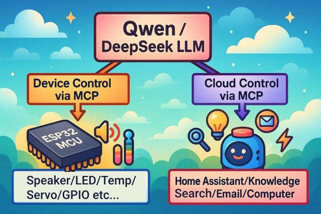
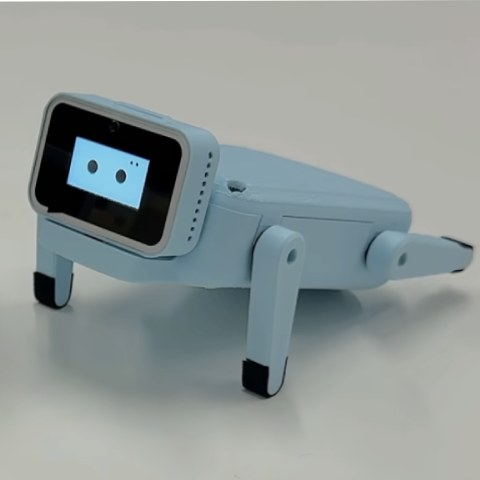

# An MCP-based Chatbot

([中文](README.md) | English | [日本語](README_ja.md))

## Introduction

👉 [Human: Installs a camera on an AI vs. AI: Instantly discovers the owner hasn't washed their hair in three days [bilibili]](https://www.bilibili.com/video/BV1bpjgzKEhd/)

👉 [DIY your AI girlfriend, a beginner's tutorial [bilibili]](https://www.bilibili.com/video/BV1XnmFYLEJN/)

The Xiaozhi AI chatbot serves as a voice interaction portal, leveraging the AI capabilities of large models like Qwen / DeepSeek to achieve multi-end control through the MCP protocol.

### Version Description

The current v2 version is not compatible with the v1 partition table, so you cannot upgrade from v1 to v2 via OTA. For an explanation of the partition table, please see [partitions/v2/README.md](partitions/v2/README.md).

All hardware using the v1 version can be upgraded to the v2 version by manually flashing the firmware.

The stable version of v1 is 1.9.2. You can switch to the v1 version by running `git checkout v1`. This branch will be maintained until February 2026.

### Implemented Features

- Wi-Fi / ML307 Cat.1 4G
- Offline voice wake-up [ESP-SR](https://github.com/espressif/esp-sr)
- Supports two communication protocols ([Websocket](docs/websocket.md) or MQTT+UDP)
- Uses OPUS audio codec
- Voice interaction based on a streaming ASR + LLM + TTS architecture
- Voiceprint recognition to identify the current speaker [3D Speaker](https://github.com/modelscope/3D-Speaker)
- OLED / LCD display with support for expressions
- Power display and management
- Supports multiple languages (Chinese, English, Japanese)
- Supports ESP32-C3, ESP32-S3, ESP32-P4 chip platforms
- Device control (volume, lights, motors, GPIO, etc.) through the device-side MCP
- Extends large model capabilities (smart home control, PC desktop operations, knowledge search, email, etc.) through the cloud-side MCP
- Custom wake words, fonts, expressions, and chat backgrounds, with support for online modification via a web interface ([Custom Assets Generator](https://github.com/78/xiaozhi-assets-generator))

## Hardware

### Breadboard DIY Practice

For a detailed tutorial, see the Feishu document:

👉 ["The Encyclopedia of Xiaozhi AI Chatbot"](https://ccnphfhqs21z.feishu.cn/wiki/F5krwD16viZoF0kKkvDcrZNYnhb?from=from_copylink)

A rendering of the breadboard is as follows:

### Supports over 70 open-source hardware (partial list)

- <a href="https://oshwhub.com/li-chuang-kai-fa-ban/li-chuang-shi-zhan-pai-esp32-s3-kai-fa-ban" target="_blank" title="Lichuang Practical ESP32-S3 Development Board">Lichuang Practical ESP32-S3 Development Board</a>
- <a href="https://github.com/espressif/esp-box" target="_blank" title="Espressif ESP32-S3-BOX3">Espressif ESP32-S3-BOX3</a>
- <a href="https://docs.m5stack.com/zh_CN/core/CoreS3" target="_blank" title="M5Stack CoreS3">M5Stack CoreS3</a>
- <a href="https://docs.m5stack.com/en/atom/Atomic%20Echo%20Base" target="_blank" title="AtomS3R + Echo Base">M5Stack AtomS3R + Echo Base</a>
- <a href="https://gf.bilibili.com/item/detail/1108782064" target="_blank" title="Magic Button 2.4">Magic Button 2.4</a>
- <a href="https://www.waveshare.net/shop/ESP32-S3-Touch-AMOLED-1.8.htm" target="_blank" title="Waveshare ESP32-S3-Touch-AMOLED-1.8">Waveshare ESP32-S3-Touch-AMOLED-1.8</a>
- <a href="https://github.com/Xinyuan-LilyGO/T-Circle-S3" target="_blank" title="LILYGO T-Circle-S3">LILYGO T-Circle-S3</a>
- <a href="https://oshwhub.com/tenclass01/xmini_c3" target="_blank" title="Shrimp Brother's Mini C3">Shrimp Brother's Mini C3</a>
- <a href="https://oshwhub.com/movecall/cuican-ai-pendant-lights-up-y" target="_blank" title="Movecall CuiCan ESP32S3">CuiCan AI Pendant</a>
- <a href="https://github.com/WMnologo/xingzhi-ai" target="_blank" title="Nologo Technology - Xingzhi - 1.54">Nologo Technology - Xingzhi - 1.54TFT</a>
- <a href="https://www.seeedstudio.com/SenseCAP-Watcher-W1-A-p-5979.html" target="_blank" title="SenseCAP Watcher">SenseCAP Watcher</a>
- <a href="https://www.bilibili.com/video/BV1BHJtz6E2S/" target="_blank" title="ESP-HI Ultra-low-cost Robot Dog">ESP-HI Ultra-low-cost Robot Dog</a>

  
  
  
  
  
  
  
  
  
  
  
  

## Software

### Firmware Flashing

For beginners, it's recommended to flash the pre-built firmware without setting up a development environment first.

The firmware connects to the official [xiaozhi.me](https://xiaozhi.me) server by default. Individual users can register for a free account to use the Qwen real-time model.

👉 [Beginner's Firmware Flashing Tutorial](https://ccnphfhqs21z.feishu.cn/wiki/Zpz4wXBtdimBrLk25WdcXzxcnNS)

### Development Environment

- Cursor or VSCode
- Install the ESP-IDF plugin and select SDK version 5.4 or higher
- Linux is better than Windows for faster compilation and to avoid driver issues
- This project uses the Google C++ code style. Please ensure your code conforms to the style guide when submitting.

### Developer Documentation

- [Custom Board Guide](docs/custom-board.md) - Learn how to create a custom board for the Xiaozhi AI
- [MCP Protocol for IoT Control](docs/mcp-usage.md) - Understand how to control IoT devices via the MCP protocol
- [MCP Protocol Interaction Flow](docs/mcp-protocol.md) - The implementation of the device-side MCP protocol
- [MQTT + UDP Hybrid Communication Protocol](docs/mqtt-udp.md)
- [A Detailed WebSocket Communication Protocol](docs/websocket.md)

## Large Model Configuration

If you already have a Xiaozhi AI chatbot device and are connected to the official server, you can log in to the [xiaozhi.me](https://xiaozhi.me) console to configure it.

👉 [Backend Operation Video Tutorial (Old Interface)](https://www.bilibili.com/video/BV1jUCUY2EKM/)

## Related Open-Source Projects

To deploy a server on your personal computer, you can refer to the following third-party open-source projects:

- [xinnan-tech/xiaozhi-esp32-server](https://github.com/xinnan-tech/xiaozhi-esp32-server) Python server
- [joey-zhou/xiaozhi-esp32-server-java](https://github.com/joey-zhou/xiaozhi-esp32-server-java) Java server
- [AnimeAIChat/xiaozhi-server-go](https://github.com/AnimeAIChat/xiaozhi-server-go) Golang server

Third-party client projects that use the Xiaozhi communication protocol:

- [huangjunsen0406/py-xiaozhi](https://github.com/huangjunsen0406/py-xiaozhi) Python client
- [TOM88812/xiaozhi-android-client](https://github.com/TOM88812/xiaozhi-android-client) Android client
- [100askTeam/xiaozhi-linux](http://github.com/100askTeam/xiaozhi-linux) Linux client provided by 100ask
- [78/xiaozhi-sf32](https://github.com/78/xiaozhi-sf32) Siche Technology's Bluetooth chip firmware
- [QuecPython/solution-xiaozhiAI](https://github.com/QuecPython/solution-xiaozhiAI) QuecPython firmware provided by Quectel

## About the Project

This is an open-source ESP32 project by Shrimp Brother, released under the MIT license, allowing anyone to use, modify, or use it for commercial purposes for free.

We hope that through this project, we can help everyone understand AI hardware development and apply the rapidly developing large language models to actual hardware devices.

If you have any ideas or suggestions, please feel free to open an issue or join our QQ group: 1011329060

## Star History

<a href="https://star-history.com/#78/xiaozhi-esp32&Date">
 <picture>
   <source media="(prefers-color-scheme: dark)" srcset="https://api.star-history.com/svg?repos=78/xiaozhi-esp32&type=Date&theme=dark" />
   <source media="(prefers-color-scheme: light)" srcset="https://api.star-history.com/svg?repos=78/xiaozhi-esp32&type=Date" />
   
 </picture>
</a>
