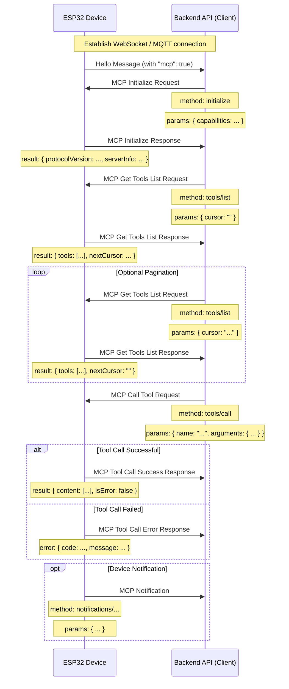

# MCP (Model Context Protocol) Interaction Flow

NOTICE: AI-assisted generation. When implementing the backend service, please refer to the code to confirm the details!!

This project's MCP protocol is used for communication between the backend API (MCP client) and the ESP32 device (MCP server), enabling the backend to discover and invoke the functionalities (tools) provided by the device.

## Protocol Format

According to the code (`main/protocols/protocol.cc`, `main/mcp_server.cc`), MCP messages are encapsulated within the message body of the base communication protocol (such as WebSocket or MQTT). Its internal structure follows the [JSON-RPC 2.0](https://www.jsonrpc.org/specification) specification.

Overall message structure example:

```json
{
  "session_id": "...", // Session ID
  "type": "mcp",       // Message type, fixed as "mcp"
  "payload": {         // JSON-RPC 2.0 payload
    "jsonrpc": "2.0",
    "method": "...",   // Method name (e.g., "initialize", "tools/list", "tools/call")
    "params": { ... }, // Method parameters (for request)
    "id": ...,         // Request ID (for request and response)
    "result": { ... }, // Method execution result (for success response)
    "error": { ... }   // Error information (for error response)
  }
}
```

The `payload` part is a standard JSON-RPC 2.0 message:

- `jsonrpc`: A fixed string "2.0".
- `method`: The name of the method to be invoked (for a Request).
- `params`: The parameters of the method, a structured value, usually an object (for a Request).
- `id`: An identifier for the request, provided by the client when sending a request, and returned as is by the server in the response. Used to match requests and responses.
- `result`: The result of a successful method execution (for a Success Response).
- `error`: Error information for a failed method execution (for an Error Response).

## Interaction Flow and Timing

The interaction of MCP mainly revolves around the client (backend API) discovering and calling "tools" on the device.

1.  **Connection Establishment and Capability Announcement**

    - **Timing:** After the device starts up and successfully connects to the backend API.
    - **Sender:** The device.
    - **Message:** The device sends a base protocol "hello" message to the backend API, which includes a list of capabilities supported by the device, such as supporting the MCP protocol (`"mcp": true`).
    - **Example (not an MCP payload, but a base protocol message):**
      ```json
      {
        "type": "hello",
        "version": ...,
        "features": {
          "mcp": true,
          ...
        },
        "transport": "websocket", // or "mqtt"
        "audio_params": { ... },
        "session_id": "..." // May be set by the device after receiving the server's hello
      }
      ```

2.  **Initialize MCP Session**

    - **Timing:** After the backend API receives the device's "hello" message and confirms that the device supports MCP, this is usually sent as the first request of the MCP session.
    - **Sender:** The backend API (client).
    - **Method:** `initialize`
    - **Message (MCP payload):**

      ```json
      {
        "jsonrpc": "2.0",
        "method": "initialize",
        "params": {
          "capabilities": {
            // Client capabilities, optional

            // Camera vision related
            "vision": {
              "url": "...", // Camera: Image processing address (must be an http address, not a websocket address)
              "token": "..." // url token
            }

            // ... other client capabilities
          }
        },
        "id": 1 // Request ID
      }
      ```

    - **Device Response Timing:** After the device receives and processes the `initialize` request.
    - **Device Response Message (MCP payload):**
      ```json
      {
        "jsonrpc": "2.0",
        "id": 1, // Matches the request ID
        "result": {
          "protocolVersion": "2024-11-05",
          "capabilities": {
            "tools": {} // The tools here do not seem to list detailed information, requires tools/list
          },
          "serverInfo": {
            "name": "...", // Device name (BOARD_NAME)
            "version": "..." // Device firmware version
          }
        }
      }
      ```

3.  **Discover Device Tool List**

    - **Timing:** When the backend API needs to get a list of the specific functions (tools) currently supported by the device and how to call them.
    - **Sender:** The backend API (client).
    - **Method:** `tools/list`
    - **Message (MCP payload):**
      ```json
      {
        "jsonrpc": "2.0",
        "method": "tools/list",
        "params": {
          "cursor": "" // Used for pagination, empty string for the first request
        },
        "id": 2 // Request ID
      }
      ```
    - **Device Response Timing:** After the device receives the `tools/list` request and generates the tool list.
    - **Device Response Message (MCP payload):**
      ```json
      {
        "jsonrpc": "2.0",
        "id": 2, // Matches the request ID
        "result": {
          "tools": [ // List of tool objects
            {
              "name": "self.get_device_status",
              "description": "...",
              "inputSchema": { ... } // Parameter schema
            },
            {
              "name": "self.audio_speaker.set_volume",
              "description": "...",
              "inputSchema": { ... } // Parameter schema
            }
            // ... more tools
          ],
          "nextCursor": "..." // If the list is large and needs pagination, this will contain the cursor value for the next request
        }
      }
      ```
    - **Pagination Handling:** If the `nextCursor` field is not empty, the client needs to send a `tools/list` request again, with this `cursor` value in the `params` to get the next page of tools.

4.  **Call Device Tool**

    - **Timing:** When the backend API needs to execute a specific function on the device.
    - **Sender:** The backend API (client).
    - **Method:** `tools/call`
    - **Message (MCP payload):**
      ```json
      {
        "jsonrpc": "2.0",
        "method": "tools/call",
        "params": {
          "name": "self.audio_speaker.set_volume", // Name of the tool to be called
          "arguments": {
            // Tool parameters, in object format
            "volume": 50 // Parameter name and its value
          }
        },
        "id": 3 // Request ID
      }
      ```
    - **Device Response Timing:** After the device receives the `tools/call` request and executes the corresponding tool function.
    - **Device Success Response Message (MCP payload):**
      ```json
      {
        "jsonrpc": "2.0",
        "id": 3, // Matches the request ID
        "result": {
          "content": [
            // Tool execution result content
            { "type": "text", "text": "true" } // Example: set_volume returns a bool
          ],
          "isError": false // Indicates success
        }
      }
      ```
    - **Device Failure Response Message (MCP payload):**
      ```json
      {
        "jsonrpc": "2.0",
        "id": 3, // Matches the request ID
        "error": {
          "code": -32601, // JSON-RPC error code, e.g., Method not found (-32601)
          "message": "Unknown tool: self.non_existent_tool" // Error description
        }
      }
      ```

5.  **Device-Initiated Messages (Notifications)**
    - **Timing:** When an event that needs to be notified to the backend API occurs within the device (e.g., a state change, although the code examples do not explicitly show tools sending such messages, the existence of `Application::SendMcpMessage` implies that the device may actively send MCP messages).
    - **Sender:** The device (server).
    - **Method:** Could be a method name starting with `notifications/`, or another custom method.
    - **Message (MCP payload):** Follows the JSON-RPC Notification format, with no `id` field.
      ```json
      {
        "jsonrpc": "2.0",
        "method": "notifications/state_changed", // Example method name
        "params": {
          "newState": "idle",
          "oldState": "connecting"
        }
        // No id field
      }
      ```
    - **Backend API Handling:** After receiving a Notification, the backend API performs the corresponding processing, but does not reply.

## Interaction Diagram

A simplified interaction sequence diagram showing the main MCP message flow:



This document outlines the main interaction flow of the MCP protocol in this project. Specific parameter details and tool functionalities need to be referenced from `main/mcp_server.cc` in `McpServer::AddCommonTools` and the implementations of the respective tools.
