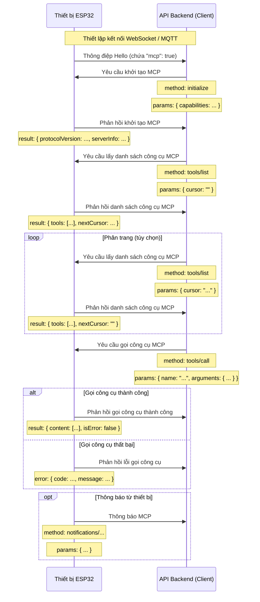

# Quy trình tương tác MCP (Model Context Protocol)

**LƯU Ý:** Nội dung được tạo bởi AI, khi triển khai dịch vụ backend, vui lòng tham khảo mã nguồn để xác nhận chi tiết!!

Giao thức MCP trong dự án này được sử dụng để giao tiếp giữa API backend (máy khách MCP) và thiết bị ESP32 (máy chủ MCP), cho phép backend khám phá và gọi các chức năng (công cụ) do thiết bị cung cấp.

## Định dạng giao thức

Dựa trên mã nguồn (`main/protocols/protocol.cc`, `main/mcp_server.cc`), thông điệp MCP được đóng gói trong phần thân của giao thức truyền thông cơ bản (như WebSocket hoặc MQTT). Cấu trúc bên trong của nó tuân thủ đặc tả [JSON-RPC 2.0](https://www.jsonrpc.org/specification).

Ví dụ về cấu trúc thông điệp tổng thể:

```json
{
  "session_id": "...", // ID phiên
  "type": "mcp",       // Loại thông điệp, cố định là "mcp"
  "payload": {         // Tải trọng JSON-RPC 2.0
    "jsonrpc": "2.0",
    "method": "...",   // Tên phương thức (ví dụ: "initialize", "tools/list", "tools/call")
    "params": { ... }, // Tham số phương thức (đối với request)
    "id": ...,         // ID yêu cầu (đối với request và response)
    "result": { ... }, // Kết quả thực thi phương thức (đối với response thành công)
    "error": { ... }   // Thông tin lỗi (đối với response lỗi)
  }
}
```

Trong đó, phần `payload` là một thông điệp JSON-RPC 2.0 tiêu chuẩn:

- `jsonrpc`: Chuỗi cố định "2.0".
- `method`: Tên phương thức cần gọi (đối với Request).
- `params`: Tham số của phương thức, một giá trị có cấu trúc, thường là một đối tượng (đối với Request).
- `id`: Mã định danh cho yêu cầu, được cung cấp bởi máy khách khi gửi yêu cầu và được máy chủ trả về nguyên vẹn trong phản hồi. Dùng để khớp yêu cầu và phản hồi.
- `result`: Kết quả khi phương thức thực thi thành công (đối với Success Response).
- `error`: Thông tin lỗi khi phương thức thực thi thất bại (đối với Error Response).

## Quy trình tương tác và thời điểm gửi

Tương tác MCP chủ yếu xoay quanh việc máy khách (API backend) khám phá và gọi các "công cụ" (Tool) trên thiết bị.

1.  **Thiết lập kết nối và thông báo khả năng**

    - **Thời điểm:** Sau khi thiết bị khởi động và kết nối thành công với API backend.
    - **Bên gửi:** Thiết bị.
    - **Thông điệp:** Thiết bị gửi thông điệp "hello" của giao thức cơ bản đến API backend, thông điệp này chứa danh sách các khả năng được thiết bị hỗ trợ, ví dụ như hỗ trợ giao thức MCP (`"mcp": true`).
    - **Ví dụ (không phải tải trọng MCP, mà là thông điệp giao thức cơ bản):**
      ```json
      {
        "type": "hello",
        "version": ...,
        "features": {
          "mcp": true,
          ...
        },
        "transport": "websocket", // hoặc "mqtt"
        "audio_params": { ... },
        "session_id": "..." // có thể được thiết lập sau khi thiết bị nhận hello từ máy chủ
      }
      ```

2.  **Khởi tạo phiên MCP**

    - **Thời điểm:** Sau khi API backend nhận được thông điệp "hello" từ thiết bị và xác nhận thiết bị hỗ trợ MCP, nó thường được gửi dưới dạng yêu cầu đầu tiên của phiên MCP.
    - **Bên gửi:** API backend (máy khách).
    - **Phương thức:** `initialize`
    - **Thông điệp (tải trọng MCP):**

      ```json
      {
        "jsonrpc": "2.0",
        "method": "initialize",
        "params": {
          "capabilities": {
            // Khả năng của máy khách, tùy chọn

            // Liên quan đến thị giác camera
            "vision": {
              "url": "...", // camera: địa chỉ xử lý hình ảnh (phải là địa chỉ http, không phải địa chỉ websocket)
              "token": "..." // token của url
            }

            // ... các khả năng khác của máy khách
          }
        },
        "id": 1 // ID yêu cầu
      }
      ```

    - **Thời điểm thiết bị phản hồi:** Sau khi thiết bị nhận và xử lý yêu cầu `initialize`.
    - **Thông điệp phản hồi của thiết bị (tải trọng MCP):**
      ```json
      {
        "jsonrpc": "2.0",
        "id": 1, // Khớp với ID yêu cầu
        "result": {
          "protocolVersion": "2024-11-05",
          "capabilities": {
            "tools": {} // tools ở đây dường như không liệt kê thông tin chi tiết, cần dùng tools/list
          },
          "serverInfo": {
            "name": "...", // Tên thiết bị (BOARD_NAME)
            "version": "..." // Phiên bản firmware của thiết bị
          }
        }
      }
      ```

3.  **Khám phá danh sách công cụ của thiết bị**

    - **Thời điểm:** Khi API backend cần lấy danh sách các chức năng (công cụ) cụ thể mà thiết bị hiện đang hỗ trợ và cách gọi chúng.
    - **Bên gửi:** API backend (máy khách).
    - **Phương thức:** `tools/list`
    - **Thông điệp (tải trọng MCP):**
      ```json
      {
        "jsonrpc": "2.0",
        "method": "tools/list",
        "params": {
          "cursor": "" // Dùng để phân trang, yêu cầu đầu tiên là chuỗi rỗng
        },
        "id": 2 // ID yêu cầu
      }
      ```
    - **Thời điểm thiết bị phản hồi:** Sau khi thiết bị nhận yêu cầu `tools/list` và tạo danh sách công cụ.
    - **Thông điệp phản hồi của thiết bị (tải trọng MCP):**
      ```json
      {
        "jsonrpc": "2.0",
        "id": 2, // Khớp với ID yêu cầu
        "result": {
          "tools": [ // Danh sách đối tượng công cụ
            {
              "name": "self.get_device_status",
              "description": "...",
              "inputSchema": { ... } // schema tham số
            },
            {
              "name": "self.audio_speaker.set_volume",
              "description": "...",
              "inputSchema": { ... } // schema tham số
            }
            // ... các công cụ khác
          ],
          "nextCursor": "..." // Nếu danh sách lớn cần phân trang, ở đây sẽ chứa giá trị cursor cho yêu cầu tiếp theo
        }
      }
      ```
    - **Xử lý phân trang:** Nếu trường `nextCursor` không rỗng, máy khách cần gửi lại yêu cầu `tools/list` và mang theo giá trị `cursor` này trong `params` để lấy trang công cụ tiếp theo.

4.  **Gọi công cụ của thiết bị**

    - **Thời điểm:** Khi API backend cần thực thi một chức năng cụ thể trên thiết bị.
    - **Bên gửi:** API backend (máy khách).
    - **Phương thức:** `tools/call`
    - **Thông điệp (tải trọng MCP):**
      ```json
      {
        "jsonrpc": "2.0",
        "method": "tools/call",
        "params": {
          "name": "self.audio_speaker.set_volume", // Tên công cụ cần gọi
          "arguments": {
            // Tham số công cụ, định dạng đối tượng
            "volume": 50 // Tên và giá trị tham số
          }
        },
        "id": 3 // ID yêu cầu
      }
      ```
    - **Thời điểm thiết bị phản hồi:** Sau khi thiết bị nhận yêu cầu `tools/call` và thực thi hàm công cụ tương ứng.
    - **Thông điệp phản hồi thành công của thiết bị (tải trọng MCP):**
      ```json
      {
        "jsonrpc": "2.0",
        "id": 3, // Khớp với ID yêu cầu
        "result": {
          "content": [
            // Nội dung kết quả thực thi công cụ
            { "type": "text", "text": "true" } // Ví dụ: set_volume trả về bool
          ],
          "isError": false // Cho biết thành công
        }
      }
      ```
    - **Thông điệp phản hồi thất bại của thiết bị (tải trọng MCP):**
      ```json
      {
        "jsonrpc": "2.0",
        "id": 3, // Khớp với ID yêu cầu
        "error": {
          "code": -32601, // Mã lỗi JSON-RPC, ví dụ Method not found (-32601)
          "message": "Unknown tool: self.non_existent_tool" // Mô tả lỗi
        }
      }
      ```

5.  **Thiết bị chủ động gửi thông điệp (Notifications)**
    - **Thời điểm:** Khi một sự kiện xảy ra bên trong thiết bị cần thông báo cho API backend (ví dụ, thay đổi trạng thái, mặc dù ví dụ mã nguồn không có công cụ nào gửi thông điệp loại này một cách rõ ràng, sự tồn tại của `Application::SendMcpMessage` ngụ ý rằng thiết bị có thể chủ động gửi thông điệp MCP).
    - **Bên gửi:** Thiết bị (máy chủ).
    - **Phương thức:** Có thể là tên phương thức bắt đầu bằng `notifications/` hoặc một phương thức tùy chỉnh khác.
    - **Thông điệp (tải trọng MCP):** Tuân thủ định dạng JSON-RPC Notification, không có trường `id`.
      ```json
      {
        "jsonrpc": "2.0",
        "method": "notifications/state_changed", // Tên phương thức ví dụ
        "params": {
          "newState": "idle",
          "oldState": "connecting"
        }
        // không có trường id
      }
      ```
    - **Xử lý của API backend:** Sau khi nhận được Notification, API backend sẽ xử lý tương ứng nhưng không trả lời.

## Sơ đồ tương tác

Dưới đây là một sơ đồ tuần tự đơn giản hóa, minh họa quy trình thông điệp MCP chính:



Tài liệu này phác thảo quy trình tương tác chính của giao thức MCP trong dự án. Các chi tiết tham số và chức năng công cụ cụ thể cần tham khảo `main/mcp_server.cc` trong `McpServer::AddCommonTools` cũng như các triển khai của từng công cụ.
