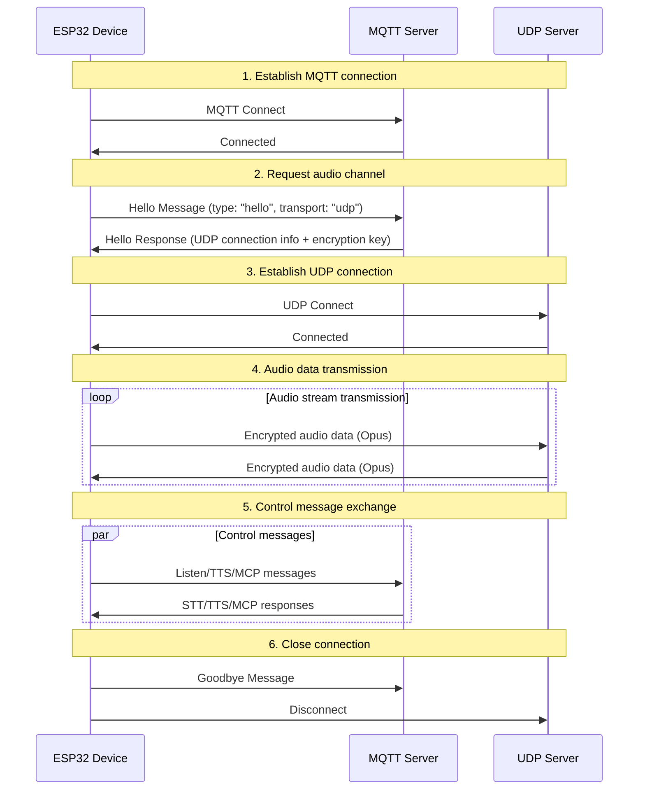
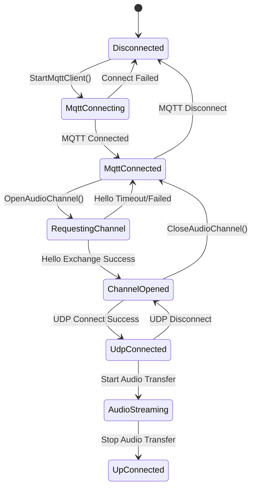

# MQTT + UDP Hybrid Communication Protocol Document

This document, based on the code implementation, outlines the MQTT + UDP hybrid communication protocol, detailing how the device and server use MQTT for control message transmission and UDP for audio data transmission.

---

## 1. Protocol Overview

This protocol uses a hybrid transmission method:
- **MQTT**: For control messages, state synchronization, and JSON data exchange.
- **UDP**: For real-time audio data transmission, with support for encryption.

### 1.1 Protocol Features

- **Dual-Channel Design**: Separation of control and data to ensure real-time performance.
- **Encrypted Transmission**: UDP audio data is encrypted using AES-CTR.
- **Sequence Number Protection**: Prevents packet replay and out-of-order delivery.
- **Automatic Reconnection**: Automatically reconnects when the MQTT connection is lost.

---

## 2. Overall Flow Overview



---

## 3. MQTT Control Channel

### 3.1 Connection Establishment

The device connects to the server via MQTT, with connection parameters including:
- **Endpoint**: MQTT server address and port.
- **Client ID**: Unique device identifier.
- **Username/Password**: Authentication credentials.
- **Keep Alive**: Heartbeat interval (default 240 seconds).

### 3.2 Hello Message Exchange

#### 3.2.1 Device Sends Hello

```json
{
  "type": "hello",
  "version": 3,
  "transport": "udp",
  "features": {
    "mcp": true
  },
  "audio_params": {
    "format": "opus",
    "sample_rate": 16000,
    "channels": 1,
    "frame_duration": 60
  }
}
```

#### 3.2.2 Server Responds with Hello

```json
{
  "type": "hello",
  "transport": "udp",
  "session_id": "xxx",
  "audio_params": {
    "format": "opus",
    "sample_rate": 24000,
    "channels": 1,
    "frame_duration": 60
  },
  "udp": {
    "server": "192.168.1.100",
    "port": 8888,
    "key": "0123456789ABCDEF0123456789ABCDEF",
    "nonce": "0123456789ABCDEF0123456789ABCDEF"
  }
}
```

**Field Descriptions:**
- `udp.server`: UDP server address.
- `udp.port`: UDP server port.
- `udp.key`: AES encryption key (hex string).
- `udp.nonce`: AES encryption nonce (hex string).

### 3.3 JSON Message Types

#### 3.3.1 Device to Server

1. **Listen Message**
   ```json
   {
     "session_id": "xxx",
     "type": "listen",
     "state": "start",
     "mode": "manual"
   }
   ```

2. **Abort Message**
   ```json
   {
     "session_id": "xxx",
     "type": "abort",
     "reason": "wake_word_detected"
   }
   ```

3. **MCP Message**
   ```json
   {
     "session_id": "xxx",
     "type": "mcp",
     "payload": {
       "jsonrpc": "2.0",
       "id": 1,
       "result": {...}
     }
   }
   ```

4. **Goodbye Message**
   ```json
   {
     "session_id": "xxx",
     "type": "goodbye"
   }
   ```

#### 3.3.2 Server to Device

Supported message types are consistent with the WebSocket protocol, including:
- **STT**: Speech-to-text results.
- **TTS**: Text-to-speech control.
- **LLM**: Emotional expression control.
- **MCP**: IoT control.
- **System**: System control.
- **Custom**: Custom messages (optional).

---

## 4. UDP Audio Channel

### 4.1 Connection Establishment

After receiving the MQTT Hello response, the device uses the UDP connection information to establish the audio channel:
1. Parse the UDP server address and port.
2. Parse the encryption key and nonce.
3. Initialize the AES-CTR encryption context.
4. Establish the UDP connection.

### 4.2 Audio Data Format

#### 4.2.1 Encrypted Audio Packet Structure

```
|type 1byte|flags 1byte|payload_len 2bytes|ssrc 4bytes|timestamp 4bytes|sequence 4bytes|
|payload payload_len bytes|
```

**Field Descriptions:**
- `type`: Packet type, fixed at 0x01.
- `flags`: Flags, currently unused.
- `payload_len`: Payload length (network byte order).
- `ssrc`: Synchronization source identifier.
- `timestamp`: Timestamp (network byte order).
- `sequence`: Sequence number (network byte order).
- `payload`: Encrypted Opus audio data.

#### 4.2.2 Encryption Algorithm

Uses **AES-CTR** mode for encryption:
- **Key**: 128-bit, provided by the server.
- **Nonce**: 128-bit, provided by the server.
- **Counter**: Includes timestamp and sequence number information.

### 4.3 Sequence Number Management

- **Sender**: `local_sequence_` increases monotonically.
- **Receiver**: `remote_sequence_` verifies continuity.
- **Replay Protection**: Rejects packets with sequence numbers less than expected.
- **Fault Tolerance**: Allows for slight sequence number jumps, logs a warning.

### 4.4 Error Handling

1. **Decryption Failure**: Logs an error, discards the packet.
2. **Sequence Number Anomaly**: Logs a warning, but still processes the packet.
3. **Packet Format Error**: Logs an error, discards the packet.

---

## 5. State Management

### 5.1 Connection State



### 5.2 State Check

The device determines if the audio channel is available with the following condition:
```cpp
bool IsAudioChannelOpened() const {
    return udp_ != nullptr && !error_occurred_ && !IsTimeout();
}
```

---

## 6. Configuration Parameters

### 6.1 MQTT Configuration

Configuration items read from settings:
- `endpoint`: MQTT server address.
- `client_id`: Client identifier.
- `username`: Username.
- `password`: Password.
- `keepalive`: Heartbeat interval (default 240 seconds).
- `publish_topic`: Publish topic.

### 6.2 Audio Parameters

- **Format**: Opus
- **Sample Rate**: 16000 Hz (device) / 24000 Hz (server)
- **Channels**: 1 (mono)
- **Frame Duration**: 60ms

---

## 7. Error Handling and Reconnection

### 7.1 MQTT Reconnection Mechanism

- Automatically retries on connection failure.
- Supports error reporting control.
- Triggers a cleanup process on disconnection.

### 7.2 UDP Connection Management

- Does not automatically retry on connection failure.
- Relies on the MQTT channel for renegotiation.
- Supports connection state queries.

### 7.3 Timeout Handling

The base `Protocol` class provides timeout detection:
- Default timeout: 120 seconds.
- Calculated based on the last reception time.
- Automatically marks as unavailable on timeout.

---

## 8. Security Considerations

### 8.1 Transmission Encryption

- **MQTT**: Supports TLS/SSL encryption (port 8883).
- **UDP**: Uses AES-CTR to encrypt audio data.

### 8.2 Authentication Mechanism

- **MQTT**: Username/password authentication.
- **UDP**: Key distribution via the MQTT channel.

### 8.3 Replay Attack Prevention

- Monotonically increasing sequence numbers.
- Rejection of expired packets.
- Timestamp validation.

---

## 9. Performance Optimization

### 9.1 Concurrency Control

Uses a mutex to protect the UDP connection:
```cpp
std::lock_guard<std::mutex> lock(channel_mutex_);
```

### 9.2 Memory Management

- Dynamic creation/destruction of network objects.
- Smart pointers for managing audio packets.
- Timely release of encryption contexts.

### 9.3 Network Optimization

- UDP connection reuse.
- Packet size optimization.
- Sequence number continuity checks.

---

## 10. Comparison with WebSocket Protocol

| Feature | MQTT + UDP | WebSocket |
|---|---|---|
| Control Channel | MQTT | WebSocket |
| Audio Channel | UDP (encrypted) | WebSocket (binary) |
| Real-time | High (UDP) | Medium |
| Reliability | Medium | High |
| Complexity | High | Low |
| Encryption | AES-CTR | TLS |
| Firewall Friendliness | Low | High |

---

## 11. Deployment Recommendations

### 11.1 Network Environment

- Ensure UDP ports are reachable.
- Configure firewall rules.
- Consider NAT traversal.

### 11.2 Server Configuration

- MQTT Broker configuration.
- UDP server deployment.
- Key management system.

### 11.3 Monitoring Metrics

- Connection success rate.
- Audio transmission latency.
- Packet loss rate.
- Decryption failure rate.

---

## 12. Conclusion

The MQTT + UDP hybrid protocol achieves efficient audio/video communication through the following design:

- **Separated Architecture**: Separation of control and data channels, each with its own responsibility.
- **Encryption Protection**: AES-CTR ensures secure transmission of audio data.
- **Serialization Management**: Prevents replay attacks and out-of-order data.
- **Automatic Recovery**: Supports automatic reconnection after disconnection.
- **Performance Optimization**: UDP transmission ensures the real-time nature of audio data.

This protocol is suitable for voice interaction scenarios with high real-time requirements, but it requires a trade-off between network complexity and transmission performance.