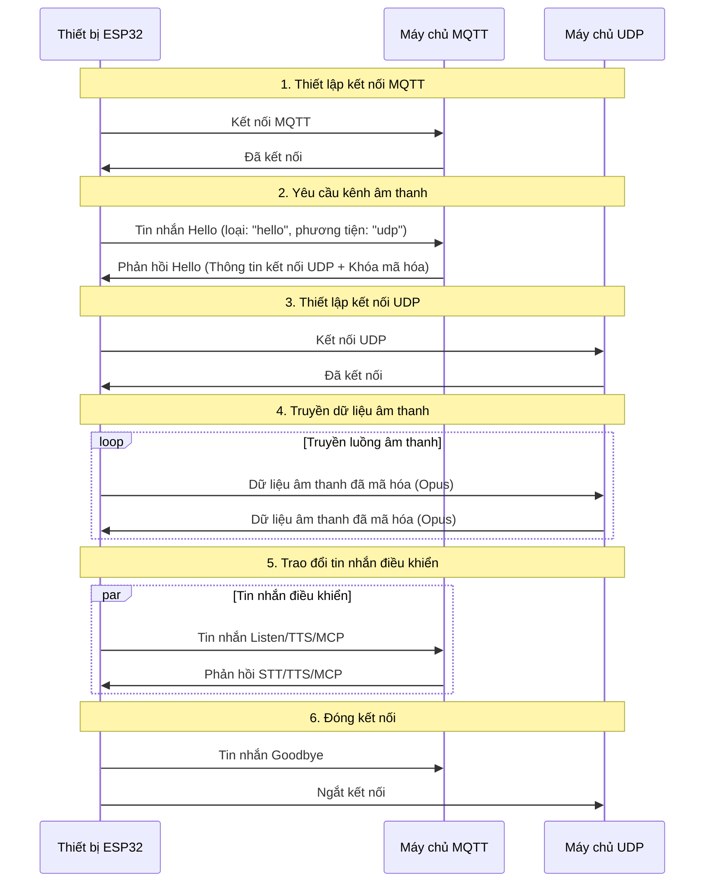
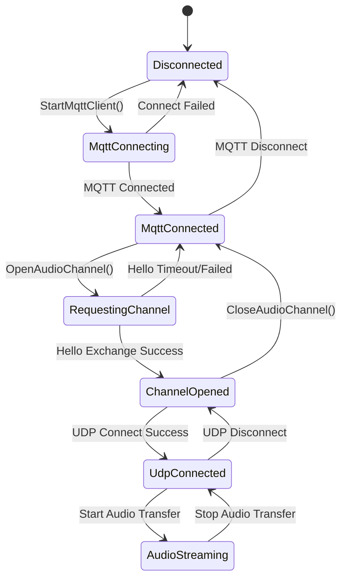

# Tài liệu Giao thức Truyền thông Hỗn hợp MQTT + UDP

Tài liệu giao thức truyền thông hỗn hợp MQTT + UDP được biên soạn dựa trên việc triển khai mã nguồn, phác thảo cách thức tương tác giữa thiết bị và máy chủ thông qua MQTT để truyền tin nhắn điều khiển và qua UDP để truyền dữ liệu âm thanh.

---

## 1. Tổng quan về Giao thức

Giao thức này sử dụng phương thức truyền hỗn hợp:
- **MQTT**: Dùng cho tin nhắn điều khiển, đồng bộ hóa trạng thái, trao đổi dữ liệu JSON
- **UDP**: Dùng để truyền dữ liệu âm thanh thời gian thực, hỗ trợ mã hóa

### 1.1 Đặc điểm Giao thức

- **Thiết kế hai kênh**: Tách biệt điều khiển và dữ liệu, đảm bảo tính thời gian thực
- **Truyền mã hóa**: Dữ liệu âm thanh UDP sử dụng mã hóa AES-CTR
- **Bảo vệ bằng số thứ tự**: Ngăn chặn phát lại và sai thứ tự gói tin
- **Tự động kết nối lại**: Tự động kết nối lại khi kết nối MQTT bị ngắt

---

## 2. Tổng quan về Quy trình Chung



---

## 3. Kênh Điều khiển MQTT

### 3.1 Thiết lập Kết nối

Thiết bị kết nối với máy chủ qua MQTT, các tham số kết nối bao gồm:
- **Endpoint**: Địa chỉ và cổng máy chủ MQTT
- **Client ID**: Mã định danh duy nhất của thiết bị
- **Username/Password**: Thông tin xác thực
- **Keep Alive**: Khoảng thời gian duy trì kết nối (mặc định 240 giây)

### 3.2 Trao đổi tin nhắn Hello

#### 3.2.1 Thiết bị gửi Hello

```json
{
  "type": "hello",
  "version": 3,
  "transport": "udp",
  "features": {
    "mcp": true
  },
  "audio_params": {
    "format": "opus",
    "sample_rate": 16000,
    "channels": 1,
    "frame_duration": 60
  }
}
```

#### 3.2.2 Máy chủ phản hồi Hello

```json
{
  "type": "hello",
  "transport": "udp",
  "session_id": "xxx",
  "audio_params": {
    "format": "opus",
    "sample_rate": 24000,
    "channels": 1,
    "frame_duration": 60
  },
  "udp": {
    "server": "192.168.1.100",
    "port": 8888,
    "key": "0123456789ABCDEF0123456789ABCDEF",
    "nonce": "0123456789ABCDEF0123456789ABCDEF"
  }
}
```

**Giải thích trường:**
- `udp.server`: Địa chỉ máy chủ UDP
- `udp.port`: Cổng máy chủ UDP
- `udp.key`: Khóa mã hóa AES (chuỗi hex)
- `udp.nonce`: Số ngẫu nhiên mã hóa AES (chuỗi hex)

### 3.3 Loại tin nhắn JSON

#### 3.3.1 Thiết bị → Máy chủ

1. **Tin nhắn Listen**
   ```json
   {
     "session_id": "xxx",
     "type": "listen",
     "state": "start",
     "mode": "manual"
   }
   ```

2. **Tin nhắn Abort**
   ```json
   {
     "session_id": "xxx",
     "type": "abort",
     "reason": "wake_word_detected"
   }
   ```

3. **Tin nhắn MCP**
   ```json
   {
     "session_id": "xxx",
     "type": "mcp",
     "payload": {
       "jsonrpc": "2.0",
       "id": 1,
       "result": {...}
     }
   }
   ```

4. **Tin nhắn Goodbye**
   ```json
   {
     "session_id": "xxx",
     "type": "goodbye"
   }
   ```

#### 3.3.2 Máy chủ → Thiết bị

Các loại tin nhắn được hỗ trợ tương tự như giao thức WebSocket, bao gồm:
- **STT**: Kết quả nhận dạng giọng nói
- **TTS**: Điều khiển tổng hợp giọng nói
- **LLM**: Điều khiển biểu cảm cảm xúc
- **MCP**: Điều khiển IoT
- **System**: Điều khiển hệ thống
- **Custom**: Tin nhắn tùy chỉnh (tùy chọn)

---

## 4. Kênh Âm thanh UDP

### 4.1 Thiết lập Kết nối

Sau khi nhận được phản hồi MQTT Hello, thiết bị sử dụng thông tin kết nối UDP trong đó để thiết lập kênh âm thanh:
1. Phân tích địa chỉ và cổng máy chủ UDP
2. Phân tích khóa mã hóa và số ngẫu nhiên
3. Khởi tạo ngữ cảnh mã hóa AES-CTR
4. Thiết lập kết nối UDP

### 4.2 Định dạng Dữ liệu Âm thanh

#### 4.2.1 Cấu trúc Gói Âm thanh được Mã hóa

```
|type 1byte|flags 1byte|payload_len 2bytes|ssrc 4bytes|timestamp 4bytes|sequence 4bytes|
|payload payload_len bytes|
```

**Giải thích trường:**
- `type`: Loại gói dữ liệu, cố định là 0x01
- `flags`: Bit cờ, hiện không được sử dụng
- `payload_len`: Độ dài tải trọng (thứ tự byte mạng)
- `ssrc`: Mã định danh nguồn đồng bộ
- `timestamp`: Dấu thời gian (thứ tự byte mạng)
- `sequence`: Số thứ tự (thứ tự byte mạng)
- `payload`: Dữ liệu âm thanh Opus đã được mã hóa

#### 4.2.2 Thuật toán Mã hóa

Sử dụng chế độ **AES-CTR** để mã hóa:
- **Khóa**: 128 bit, do máy chủ cung cấp
- **Số ngẫu nhiên**: 128 bit, do máy chủ cung cấp
- **Bộ đếm**: Bao gồm thông tin dấu thời gian và số thứ tự

### 4.3 Quản lý Số Thứ tự

- **Bên gửi**: `local_sequence_` tăng đơn điệu
- **Bên nhận**: `remote_sequence_` xác minh tính liên tục
- **Chống phát lại**: Từ chối các gói dữ liệu có số thứ tự nhỏ hơn giá trị mong đợi
- **Xử lý lỗi**: Cho phép bỏ qua số thứ tự nhỏ, ghi lại cảnh báo

### 4.4 Xử lý Lỗi

1. **Giải mã thất bại**: Ghi lại lỗi, loại bỏ gói dữ liệu
2. **Số thứ tự bất thường**: Ghi lại cảnh báo, nhưng vẫn xử lý gói dữ liệu
3. **Lỗi định dạng gói dữ liệu**: Ghi lại lỗi, loại bỏ gói dữ liệu

---

## 5. Quản lý Trạng thái

### 5.1 Trạng thái Kết nối



### 5.2 Kiểm tra Trạng thái

Thiết bị xác định xem kênh âm thanh có khả dụng hay không thông qua các điều kiện sau:
```cpp
bool IsAudioChannelOpened() const {
    return udp_ != nullptr && !error_occurred_ && !IsTimeout();
}
```

---

## 6. Tham số Cấu hình

### 6.1 Cấu hình MQTT

Các mục cấu hình được đọc từ cài đặt:
- `endpoint`: Địa chỉ máy chủ MQTT
- `client_id`: Mã định danh máy khách
- `username`: Tên người dùng
- `password`: Mật khẩu
- `keepalive`: Khoảng thời gian duy trì kết nối (mặc định 240 giây)
- `publish_topic`: Chủ đề xuất bản

### 6.2 Tham số Âm thanh

- **Định dạng**: Opus
- **Tốc độ lấy mẫu**: 16000 Hz (thiết bị) / 24000 Hz (máy chủ)
- **Số kênh**: 1 (đơn âm)
- **Thời lượng khung**: 60ms

---

## 7. Xử lý Lỗi và Kết nối lại

### 7.1 Cơ chế Kết nối lại MQTT

- Tự động thử lại khi kết nối không thành công
- Hỗ trợ điều khiển báo cáo lỗi
- Kích hoạt quy trình dọn dẹp khi ngắt kết nối

### 7.2 Quản lý Kết nối UDP

- Không tự động thử lại khi kết nối không thành công
- Phụ thuộc vào kênh MQTT để thương lượng lại
- Hỗ trợ truy vấn trạng thái kết nối

### 7.3 Xử lý Thời gian chờ

Lớp cơ sở `Protocol` cung cấp tính năng phát hiện thời gian chờ:
- Thời gian chờ mặc định: 120 giây
- Dựa trên thời gian nhận cuối cùng để tính toán
- Tự động đánh dấu là không khả dụng khi hết thời gian chờ

---

## 8. Cân nhắc về Bảo mật

### 8.1 Mã hóa Truyền

- **MQTT**: Hỗ trợ mã hóa TLS/SSL (cổng 8883)
- **UDP**: Sử dụng mã hóa AES-CTR cho dữ liệu âm thanh

### 8.2 Cơ chế Xác thực

- **MQTT**: Xác thực bằng tên người dùng/mật khẩu
- **UDP**: Phân phối khóa qua kênh MQTT

### 8.3 Chống Tấn công Phát lại

- Số thứ tự tăng đơn điệu
- Từ chối các gói dữ liệu đã hết hạn
- Xác minh dấu thời gian

---

## 9. Tối ưu hóa Hiệu suất

### 9.1 Điều khiển Đồng thời

Sử dụng khóa mutex để bảo vệ kết nối UDP:
```cpp
std::lock_guard<std::mutex> lock(channel_mutex_);
```

### 9.2 Quản lý Bộ nhớ

- Tạo/hủy động các đối tượng mạng
- Quản lý gói dữ liệu âm thanh bằng con trỏ thông minh
- Giải phóng ngữ cảnh mã hóa kịp thời

### 9.3 Tối ưu hóa Mạng

- Tái sử dụng kết nối UDP
- Tối ưu hóa kích thước gói dữ liệu
- Kiểm tra tính liên tục của số thứ tự

---

## 10. So sánh với Giao thức WebSocket

| Đặc tính | MQTT + UDP | WebSocket |
|---|---|---|
| Kênh điều khiển | MQTT | WebSocket |
| Kênh âm thanh | UDP (mã hóa) | WebSocket (nhị phân) |
| Thời gian thực | Cao (UDP) | Trung bình |
| Độ tin cậy | Trung bình | Cao |
| Độ phức tạp | Cao | Thấp |
| Mã hóa | AES-CTR | TLS |
| Mức độ thân thiện với tường lửa | Thấp | Cao |

---

## 11. Đề xuất Triển khai

### 11.1 Môi trường Mạng

- Đảm bảo cổng UDP có thể truy cập được
- Cấu hình quy tắc tường lửa
- Cân nhắc NAT traversal

### 11.2 Cấu hình Máy chủ

- Cấu hình MQTT Broker
- Triển khai máy chủ UDP
- Hệ thống quản lý khóa

### 11.3 Chỉ số Giám sát

- Tỷ lệ kết nối thành công
- Độ trễ truyền âm thanh
- Tỷ lệ mất gói dữ liệu
- Tỷ lệ giải mã thất bại

---

## 12. Tổng kết

Giao thức hỗn hợp MQTT + UDP đạt được hiệu quả truyền thông âm thanh và video thông qua các thiết kế sau:

- **Kiến trúc tách biệt**: Tách biệt kênh điều khiển và dữ liệu, mỗi kênh thực hiện chức năng riêng
- **Bảo vệ bằng mã hóa**: AES-CTR đảm bảo truyền dữ liệu âm thanh an toàn
- **Quản lý tuần tự**: Ngăn chặn tấn công phát lại và dữ liệu sai thứ tự
- **Tự động khôi phục**: Hỗ trợ tự động kết nối lại sau khi ngắt kết nối
- **Tối ưu hóa hiệu suất**: Truyền UDP đảm bảo tính thời gian thực của dữ liệu âm thanh

Giao thức này phù hợp với các kịch bản tương tác bằng giọng nói có yêu cầu cao về tính thời gian thực, nhưng cần phải cân nhắc giữa độ phức tạp của mạng và hiệu suất truyền. 