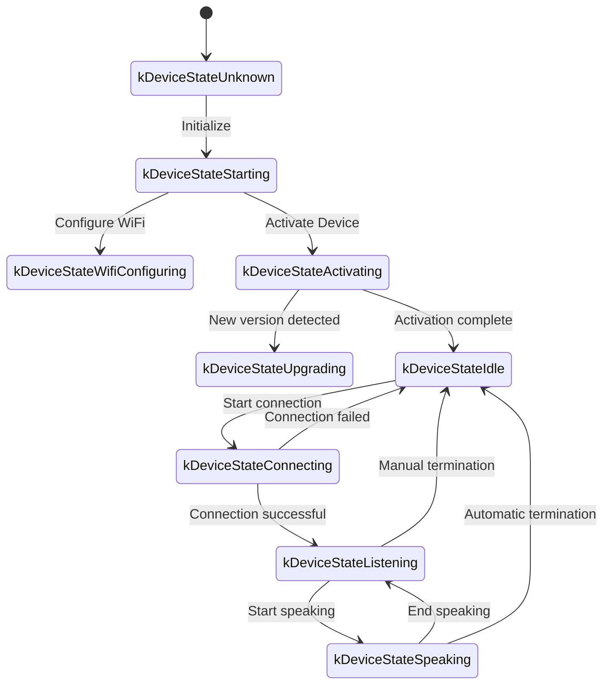
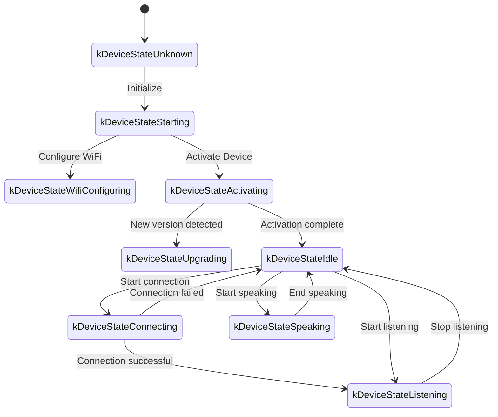

The following is a WebSocket communication protocol document organized based on the code implementation, outlining how the device and server interact via WebSocket.

This document is inferred solely from the provided code. Actual deployment may require further confirmation or supplementation in conjunction with the server-side implementation.

---

## 1. Overall Flow Overview

1.  **Device Initialization**
    -   Device powers on, initializes `Application`:
        -   Initializes audio codec, display, LEDs, etc.
        -   Connects to the network
        -   Creates and initializes a WebSocket protocol instance (`WebsocketProtocol`) that implements the `Protocol` interface
    -   Enters the main loop to wait for events (audio input, audio output, scheduled tasks, etc.).

2.  **Establish WebSocket Connection**
    -   When the device needs to start a voice session (e.g., user wake-up, manual button press), `OpenAudioChannel()` is called:
        -   Gets the WebSocket URL from the configuration
        -   Sets several request headers (`Authorization`, `Protocol-Version`, `Device-Id`, `Client-Id`)
        -   Calls `Connect()` to establish a WebSocket connection with the server

3.  **Device Sends "hello" Message**
    -   After a successful connection, the device sends a JSON message with a structure like this:
    ```json
    {
      "type": "hello",
      "version": 1,
      "features": {
        "mcp": true
      },
      "transport": "websocket",
      "audio_params": {
        "format": "opus",
        "sample_rate": 16000,
        "channels": 1,
        "frame_duration": 60
      }
    }
    ```
    -   The `features` field is optional, and its content is automatically generated based on the device's build configuration. For example, `"mcp": true` indicates support for the MCP protocol.
    -   The value of `frame_duration` corresponds to `OPUS_FRAME_DURATION_MS` (e.g., 60ms).

4.  **Server Replies with "hello"**
    -   The device waits for the server to return a JSON message containing `"type": "hello"` and checks if `"transport": "websocket"` matches.
    -   The server can optionally send a `session_id` field, which the device will automatically record upon receipt.
    -   Example:
    ```json
    {
      "type": "hello",
      "transport": "websocket",
      "session_id": "xxx",
      "audio_params": {
        "format": "opus",
        "sample_rate": 24000,
        "channels": 1,
        "frame_duration": 60
      }
    }
    ```
    -   If it matches, the server is considered ready, and the audio channel is marked as successfully opened.
    -   If a correct reply is not received within the timeout period (default 10 seconds), the connection is considered failed, and a network error callback is triggered.

5.  **Subsequent Message Interaction**
    -   Two main types of data can be sent between the device and the server:
        1.  **Binary audio data** (Opus encoded)
        2.  **Text JSON messages** (for transmitting chat status, TTS/STT events, MCP protocol messages, etc.)

    -   In the code, the receive callbacks are mainly divided into:
        -   `OnData(...)`:
            -   When `binary` is `true`, it is considered an audio frame; the device will decode it as Opus data.
            -   When `binary` is `false`, it is considered JSON text, which needs to be parsed with cJSON on the device for corresponding business logic processing (e.g., chat, TTS, MCP protocol messages).

    -   When the server or network disconnects, the `OnDisconnected()` callback is triggered:
        -   The device calls `on_audio_channel_closed_()` and eventually returns to an idle state.

6.  **Close WebSocket Connection**
    -   When the device needs to end a voice session, it calls `CloseAudioChannel()` to actively disconnect and return to an idle state.
    -   Alternatively, if the server actively disconnects, the same callback flow will be triggered.

---

## 2. Common Request Headers

When establishing a WebSocket connection, the code example sets the following request headers:

-   `Authorization`: Used to store the access token, in the format `"Bearer <token>"`
-   `Protocol-Version`: Protocol version number, consistent with the `version` field in the hello message body
-   `Device-Id`: The device's physical network card MAC address
-   `Client-Id`: A software-generated UUID (erasing NVS or re-flashing the full firmware will reset it)

These headers are sent to the server along with the WebSocket handshake, and the server can perform validation, authentication, etc., as needed.

---

## 3. Binary Protocol Versions

The device supports multiple binary protocol versions, specified by the `version` field in the configuration:

### 3.1 Version 1 (Default)
Directly sends Opus audio data with no extra metadata. The WebSocket protocol will distinguish between text and binary.

### 3.2 Version 2
Uses the `BinaryProtocol2` structure:
```c
struct BinaryProtocol2 {
    uint16_t version;        // Protocol version
    uint16_t type;           // Message type (0: OPUS, 1: JSON)
    uint32_t reserved;       // Reserved field
    uint32_t timestamp;      // Timestamp (milliseconds, for server-side AEC)
    uint32_t payload_size;   // Payload size (bytes)
    uint8_t payload[];       // Payload data
} __attribute__((packed));
```

### 3.3 Version 3
Uses the `BinaryProtocol3` structure:
```c
struct BinaryProtocol3 {
    uint8_t type;            // Message type
    uint8_t reserved;        // Reserved field
    uint16_t payload_size;   // Payload size
    uint8_t payload[];       // Payload data
} __attribute__((packed));
```

---

## 4. JSON Message Structure

WebSocket text frames are transmitted in JSON format. The following are common `"type"` fields and their corresponding business logic. If a message contains fields not listed, they may be optional or specific implementation details.

### 4.1 Device to Server

1.  **Hello**
    -   Sent by the device after a successful connection to inform the server of basic parameters.
    -   Example:
        ```json
        {
          "type": "hello",
          "version": 1,
          "features": {
            "mcp": true
          },
          "transport": "websocket",
          "audio_params": {
            "format": "opus",
            "sample_rate": 16000,
            "channels": 1,
            "frame_duration": 60
          }
        }
        ```

2.  **Listen**
    -   Indicates that the device is starting or stopping recording.
    -   Common fields:
        -   `"session_id"`: Session identifier
        -   `"type": "listen"`
        -   `"state"`: `"start"`, `"stop"`, `"detect"` (wake word detection has been triggered)
        -   `"mode"`: `"auto"`, `"manual"`, or `"realtime"`, indicating the recognition mode.
    -   Example: Start listening
        ```json
        {
          "session_id": "xxx",
          "type": "listen",
          "state": "start",
          "mode": "manual"
        }
        ```

3.  **Abort**
    -   Terminates the current speech (TTS playback) or audio channel.
    -   Example:
        ```json
        {
          "session_id": "xxx",
          "type": "abort",
          "reason": "wake_word_detected"
        }
        ```
    -   The `reason` value can be `"wake_word_detected"` or others.

4.  **Wake Word Detected**
    -   Used by the device to inform the server that a wake word has been detected.
    -   Before sending this message, the Opus audio data of the wake word can be sent in advance for voiceprint detection by the server.
    -   Example:
        ```json
        {
          "session_id": "xxx",
          "type": "listen",
          "state": "detect",
          "text": "Hello, Xiaoming"
        }
        ```

5.  **MCP**
    -   A new generation protocol recommended for IoT control. All device capability discovery, tool calls, etc., are performed through messages with `type: "mcp"`, and the payload is standard JSON-RPC 2.0 (see [MCP Protocol Document](./mcp-protocol.md) for details).

    -   **Example of the device sending a result to the server:**
        ```json
        {
          "session_id": "xxx",
          "type": "mcp",
          "payload": {
            "jsonrpc": "2.0",
            "id": 1,
            "result": {
              "content": [
                { "type": "text", "text": "true" }
              ],
              "isError": false
            }
          }
        }
        ```

---

### 4.2 Server to Device

1.  **Hello**
    -   Handshake confirmation message returned by the server.
    -   Must contain `"type": "hello"` and `"transport": "websocket"`.
    -   May include `audio_params` to indicate the server's expected audio parameters or to align with the device's configuration.
    -   The server can optionally send a `session_id` field, which the device will automatically record upon receipt.
    -   Upon successful receipt, the device sets an event flag, indicating that the WebSocket channel is ready.

2.  **STT**
    -   `{"session_id": "xxx", "type": "stt", "text": "..."}`
    -   Indicates that the server has recognized the user's speech (e.g., speech-to-text results).
    -   The device may display this text on the screen before proceeding to a response.

3.  **LLM**
    -   `{"session_id": "xxx", "type": "llm", "emotion": "happy", "text": "😀"}`
    -   The server instructs the device to adjust its emotional animation / UI expression.

4.  **TTS**
    -   `{"session_id": "xxx", "type": "tts", "state": "start"}`: The server is ready to send TTS audio, and the device enters the "speaking" playback state.
    -   `{"session_id": "xxx", "type": "tts", "state": "stop"}`: Indicates the end of the current TTS.
    -   `{"session_id": "xxx", "type": "tts", "state": "sentence_start", "text": "..."}`
        -   Instructs the device to display the text segment to be played or read on the interface (e.g., for display to the user).

5.  **MCP**
    -   The server sends IoT-related control commands or returns call results through messages with `type: "mcp"`. The payload structure is the same as above.

    -   **Example of the server sending a `tools/call` to the device:**
        ```json
        {
          "session_id": "xxx",
          "type": "mcp",
          "payload": {
            "jsonrpc": "2.0",
            "method": "tools/call",
            "params": {
              "name": "self.light.set_rgb",
              "arguments": { "r": 255, "g": 0, "b": 0 }
            },
            "id": 1
          }
        }
        ```

6.  **System**
    -   System control commands, often used for remote upgrades.
    -   Example:
        ```json
        {
          "session_id": "xxx",
          "type": "system",
          "command": "reboot"
        }
        ```
    -   Supported commands:
        -   `"reboot"`: Reboots the device

7.  **Custom** (Optional)
    -   Custom messages, supported when `CONFIG_RECEIVE_CUSTOM_MESSAGE` is enabled.
    -   Example:
        ```json
        {
          "session_id": "xxx",
          "type": "custom",
          "payload": {
            "message": "Custom content"
          }
        }
        ```

8.  **Audio Data: Binary Frames**
    -   When the server sends binary audio frames (Opus encoded), the device decodes and plays them.
    -   If the device is in the "listening" (recording) state, received audio frames will be ignored or cleared to prevent conflicts.

---

## 5. Audio Codec

1.  **Device Sends Recording Data**
    -   Audio input, after possible echo cancellation, noise reduction, or volume gain, is encoded with Opus and packaged into binary frames to be sent to the server.
    -   Depending on the protocol version, it may send Opus data directly (version 1) or use a binary protocol with metadata (versions 2/3).

2.  **Device Plays Received Audio**
    -   When binary frames are received from the server, they are also considered Opus data.
    -   The device will decode them and then pass them to the audio output interface for playback.
    -   If the server's audio sample rate is different from the device's, resampling will be performed after decoding.

---

## 6. Common State Transitions

The following are common key state transitions on the device, corresponding to WebSocket messages:

1.  **Idle** -> **Connecting**
    -   After user trigger or wake-up, the device calls `OpenAudioChannel()` -> establishes a WebSocket connection -> sends `"type":"hello"`.

2.  **Connecting** -> **Listening**
    -   After a successful connection, if `SendStartListening(...)` is executed, it enters the recording state. The device will continuously encode microphone data and send it to the server.

3.  **Listening** -> **Speaking**
    -   Receives a TTS Start message from the server (`{"type":"tts","state":"start"}`) -> stops recording and plays the received audio.

4.  **Speaking** -> **Idle**
    -   Server TTS Stop (`{"type":"tts","state":"stop"}`) -> audio playback ends. If not configured to automatically listen, it returns to Idle; if configured for an automatic loop, it re-enters Listening.

5.  **Listening** / **Speaking** -> **Idle** (in case of an exception or active interruption)
    -   Calls `SendAbortSpeaking(...)` or `CloseAudioChannel()` -> interrupts the session -> closes the WebSocket -> returns to the Idle state.

### Automatic Mode State Transition Diagram



### Manual Mode State Transition Diagram



---

## 7. Error Handling

1.  **Connection Failure**
    -   If `Connect(url)` returns failure or times out while waiting for the server's "hello" message, the `on_network_error_()` callback is triggered. The device will display an error message like "Cannot connect to the service."

2.  **Server Disconnection**
    -   If the WebSocket disconnects unexpectedly, the `OnDisconnected()` callback is triggered:
        -   The device calls `on_audio_channel_closed_()`
        -   Switches to Idle or another retry logic.

---

## 8. Other Notes

1.  **Authentication**
    -   The device provides authentication by setting `Authorization: Bearer <token>`, and the server needs to verify its validity.
    -   If the token is expired or invalid, the server can refuse the handshake or disconnect later.

2.  **Session Control**
    -   Some messages in the code include `session_id` to distinguish between separate conversations or operations. The server can process different sessions separately as needed.

3.  **Audio Payload**
    -   The code defaults to using the Opus format, with `sample_rate = 16000` and mono channel. The frame duration is controlled by `OPUS_FRAME_DURATION_MS`, which is typically 60ms. It can be adjusted based on bandwidth or performance. For better music playback, the server's downstream audio may use a 24000 sample rate.

4.  **Protocol Version Configuration**
    -   The binary protocol version (1, 2, or 3) is configured through the `version` field in the settings.
    -   Version 1: Sends Opus data directly.
    -   Version 2: Uses a binary protocol with a timestamp, suitable for server-side AEC.
    -   Version 3: Uses a simplified binary protocol.

5.  **MCP Protocol Recommended for IoT Control**
    -   It is recommended to use the MCP protocol (type: "mcp") for all IoT capability discovery, state synchronization, and control commands between the device and the server. The original `type: "iot"` solution is deprecated.
    -   The MCP protocol can be transmitted over various underlying protocols like WebSocket and MQTT, offering better scalability and standardization.
    -   For detailed usage, please refer to the [MCP Protocol Document](./mcp-protocol.md) and the [MCP IoT Control Usage Guide](./mcp-usage.md).

6.  **Erroneous or Abnormal JSON**
    -   If a JSON message is missing necessary fields, such as `{"type": ...}`, the device will log an error (`ESP_LOGE(TAG, "Missing message type, data: %s", data);`) and will not execute any business logic.

---

## 9. Message Examples

Here is a typical two-way message example (simplified flow):

1.  **Device to Server** (Handshake)
    ```json
    {
      "type": "hello",
      "version": 1,
      "features": {
        "mcp": true
      },
      "transport": "websocket",
      "audio_params": {
        "format": "opus",
        "sample_rate": 16000,
        "channels": 1,
        "frame_duration": 60
      }
    }
    ```

2.  **Server to Device** (Handshake Response)
    ```json
    {
      "type": "hello",
      "transport": "websocket",
      "session_id": "xxx",
      "audio_params": {
        "format": "opus",
        "sample_rate": 16000
      }
    }
    ```

3.  **Device to Server** (Start Listening)
    ```json
    {
      "session_id": "xxx",
      "type": "listen",
      "state": "start",
      "mode": "auto"
    }
    ```
    At the same time, the device starts sending binary frames (Opus data).

4.  **Server to Device** (ASR Result)
    ```json
    {
      "session_id": "xxx",
      "type": "stt",
      "text": "User's speech"
    }
    ```

5.  **Server to Device** (TTS Start)
    ```json
    {
      "session_id": "xxx",
      "type": "tts",
      "state": "start"
    }
    ```
    Then the server sends binary audio frames to the device for playback.

6.  **Server to Device** (TTS End)
    ```json
    {
      "session_id": "xxx",
      "type": "tts",
      "state": "stop"
    }
    ```
    The device stops playing audio and returns to an idle state if there are no more commands.

---

## 10. Conclusion

This protocol, by transmitting JSON text and binary audio frames over WebSocket, accomplishes functions including audio stream uploading, TTS audio playback, speech recognition and state management, and MCP command delivery. Its core features are:

-   **Handshake Phase**: Sends `"type":"hello"` and waits for the server's response.
-   **Audio Channel**: Uses Opus-encoded binary frames for two-way transmission of the voice stream, supporting multiple protocol versions.
-   **JSON Messages**: Uses the `"type"` as the core field to identify different business logic, including TTS, STT, MCP, WakeWord, System, Custom, etc.
-   **Scalability**: Can add fields to JSON messages or perform additional authentication in the headers as needed.

A smooth communication requires the server and device to agree in advance on the meaning of various message fields, timing logic, and error handling rules. The above information can serve as a basic document for subsequent integration, development, or extension.
