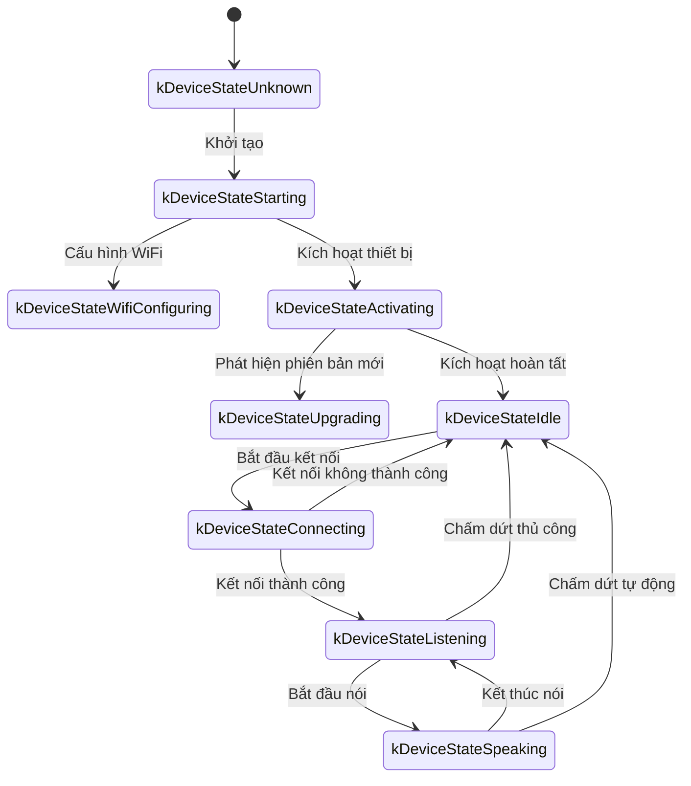
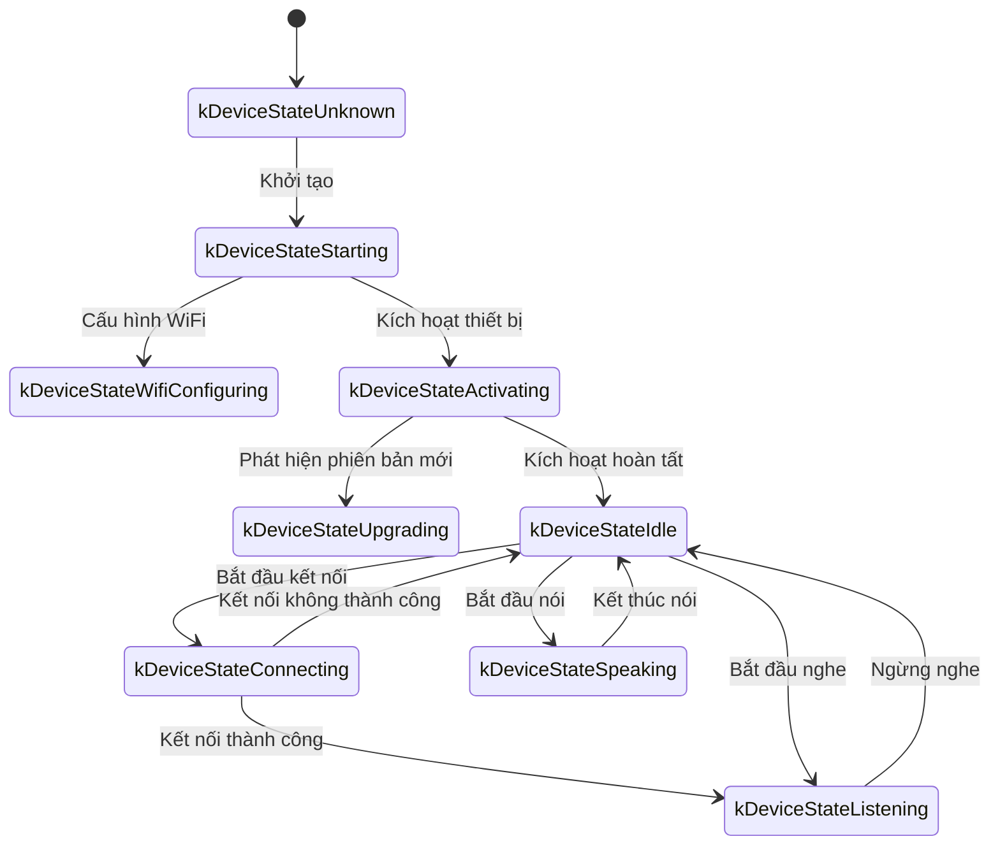

Sau đây là tài liệu giao thức truyền thông WebSocket được biên soạn dựa trên việc triển khai mã, phác thảo cách thiết bị và máy chủ tương tác với nhau thông qua WebSocket.

Tài liệu này chỉ được suy ra dựa trên mã được cung cấp và có thể cần xác nhận hoặc bổ sung thêm kết hợp với việc triển khai phía máy chủ khi triển khai thực tế.

---

## 1. Tổng quan về quy trình

1.  **Khởi tạo phía thiết bị**
    -   Thiết bị bật nguồn, khởi tạo `Application`:
        -   Khởi tạo bộ giải mã âm thanh, màn hình, đèn LED, v.v.
        -   Kết nối mạng
        -   Tạo và khởi tạo một phiên bản giao thức WebSocket (`WebsocketProtocol`) triển khai giao diện `Protocol`
    -   Vào vòng lặp chính chờ các sự kiện (đầu vào âm thanh, đầu ra âm thanh, tác vụ lên lịch, v.v.).

2.  **Thiết lập kết nối WebSocket**
    -   Khi thiết bị cần bắt đầu một phiên thoại (ví dụ: người dùng đánh thức, nhấn nút thủ công, v.v.), hãy gọi `OpenAudioChannel()`:
        -   Lấy URL WebSocket theo cấu hình
        -   Đặt một số tiêu đề yêu cầu (`Authorization`, `Protocol-Version`, `Device-Id`, `Client-Id`)
        -   Gọi `Connect()` để thiết lập kết nối WebSocket với máy chủ

3.  **Thiết bị gửi thông báo "hello"**
    -   Sau khi kết nối thành công, thiết bị sẽ gửi một thông báo JSON, cấu trúc ví dụ như sau:
    ```json
    {
      "type": "hello",
      "version": 1,
      "features": {
        "mcp": true
      },
      "transport": "websocket",
      "audio_params": {
        "format": "opus",
        "sample_rate": 16000,
        "channels": 1,
        "frame_duration": 60
      }
    }
    ```
    -   Trong đó trường `features` là tùy chọn, nội dung được tạo tự động theo cấu hình biên dịch của thiết bị. Ví dụ: `"mcp": true` cho biết hỗ trợ giao thức MCP.
    -   Giá trị của `frame_duration` tương ứng với `OPUS_FRAME_DURATION_MS` (ví dụ: 60ms).

4.  **Máy chủ trả lời "hello"**
    -   Thiết bị đợi máy chủ trả về một thông báo JSON chứa `"type": "hello"` và kiểm tra xem `"transport": "websocket"` có khớp không.
    -   Máy chủ có thể tùy chọn gửi xuống trường `session_id`, thiết bị sẽ tự động ghi lại sau khi nhận được.
    -   Ví dụ:
    ```json
    {
      "type": "hello",
      "transport": "websocket",
      "session_id": "xxx",
      "audio_params": {
        "format": "opus",
        "sample_rate": 24000,
        "channels": 1,
        "frame_duration": 60
      }
    }
    ```
    -   Nếu khớp, thì máy chủ được coi là đã sẵn sàng, đánh dấu kênh âm thanh đã mở thành công.
    -   Nếu không nhận được phản hồi chính xác trong thời gian chờ (mặc định là 10 giây), kết nối được coi là không thành công và kích hoạt gọi lại lỗi mạng.

5.  **Tương tác thông báo tiếp theo**
    -   Giữa thiết bị và máy chủ có thể gửi hai loại dữ liệu chính:
        1.  **Dữ liệu âm thanh nhị phân** (mã hóa Opus)
        2.  **Thông báo JSON văn bản** (để truyền trạng thái trò chuyện, sự kiện TTS/STT, thông báo giao thức MCP, v.v.)

    -   Trong mã, các lệnh gọi lại nhận chủ yếu được chia thành:
        -   `OnData(...)`:
            -   Khi `binary` là `true`, nó được coi là một khung âm thanh; thiết bị sẽ coi nó là dữ liệu Opus để giải mã.
            -   Khi `binary` là `false`, nó được coi là văn bản JSON, cần được phân tích cú pháp bằng cJSON ở phía thiết bị và xử lý logic nghiệp vụ tương ứng (chẳng hạn như trò chuyện, TTS, thông báo giao thức MCP, v.v.).

    -   Khi máy chủ hoặc mạng bị ngắt kết nối, lệnh gọi lại `OnDisconnected()` được kích hoạt:
        -   Thiết bị sẽ gọi `on_audio_channel_closed_()` và cuối cùng trở về trạng thái rảnh.

6.  **Đóng kết nối WebSocket**
    -   Khi thiết bị cần kết thúc phiên thoại, nó sẽ gọi `CloseAudioChannel()` để chủ động ngắt kết nối và trở về trạng thái rảnh.
    -   Hoặc nếu phía máy chủ chủ động ngắt kết nối, nó cũng sẽ gây ra quy trình gọi lại tương tự.

---

## 2. Tiêu đề yêu cầu chung

Khi thiết lập kết nối WebSocket, ví dụ mã đặt các tiêu đề yêu cầu sau:

-   `Authorization`: Dùng để lưu trữ mã thông báo truy cập, có dạng `"Bearer <token>"`
-   `Protocol-Version`: Số phiên bản giao thức, nhất quán với trường `version` trong phần thân thông báo hello
-   `Device-Id`: Địa chỉ MAC của card mạng vật lý của thiết bị
-   `Client-Id`: UUID được tạo bằng phần mềm (xóa NVS hoặc nạp lại firmware hoàn chỉnh sẽ đặt lại)

Các tiêu đề này sẽ được gửi đến máy chủ cùng với quá trình bắt tay WebSocket và máy chủ có thể xác minh, xác thực, v.v. khi cần.

---

## 3. Phiên bản giao thức nhị phân

Thiết bị hỗ trợ nhiều phiên bản giao thức nhị phân, được chỉ định thông qua trường `version` trong cấu hình:

### 3.1 Phiên bản 1 (mặc định)

Trực tiếp gửi dữ liệu âm thanh Opus, không có siêu dữ liệu bổ sung. Giao thức Websocket sẽ phân biệt giữa văn bản và nhị phân.

### 3.2 Phiên bản 2

Sử dụng cấu trúc `BinaryProtocol2`:

```c
struct BinaryProtocol2 {
    uint16_t version;        // Phiên bản giao thức
    uint16_t type;           // Loại thông báo (0: OPUS, 1: JSON)
    uint32_t reserved;       // Trường dành riêng
    uint32_t timestamp;      // Dấu thời gian (mili giây, để khử tiếng vọng phía máy chủ)
    uint32_t payload_size;   // Kích thước tải trọng (byte)
    uint8_t payload[];       // Dữ liệu tải trọng
} __attribute__((packed));
```

### 3.3 Phiên bản 3

Sử dụng cấu trúc `BinaryProtocol3`:

```c
struct BinaryProtocol3 {
    uint8_t type;            // Loại thông báo
    uint8_t reserved;        // Trường dành riêng
    uint16_t payload_size;   // Kích thước tải trọng
    uint8_t payload[];       // Dữ liệu tải trọng
} __attribute__((packed));
```

---

## 4. Cấu trúc thông báo JSON

Các khung văn bản WebSocket được truyền ở định dạng JSON. Sau đây là các trường `"type"` phổ biến và logic nghiệp vụ tương ứng của chúng. Nếu thông báo chứa các trường không được liệt kê, chúng có thể là tùy chọn hoặc chi tiết triển khai cụ thể.

### 4.1 Thiết bị → Máy chủ

1.  **Hello**
    -   Sau khi kết nối thành công, được gửi bởi thiết bị để thông báo cho máy chủ các tham số cơ bản.
    -   Ví dụ:

    ```json
    {
      "type": "hello",
      "version": 1,
      "features": {
        "mcp": true
      },
      "transport": "websocket",
      "audio_params": {
        "format": "opus",
        "sample_rate": 16000,
        "channels": 1,
        "frame_duration": 60
      }
    }
    ```

2.  **Listen**
    -   Cho biết thiết bị bắt đầu hoặc dừng nghe ghi âm.
    -   Các trường phổ biến:
        -   `"session_id"`: Mã định danh phiên
        -   `"type": "listen"`
        -   `"state"`: `"start"`, `"stop"`, `"detect"` (đã kích hoạt phát hiện đánh thức)
        -   `"mode"`: `"auto"`, `"manual"` hoặc `"realtime"`, cho biết chế độ nhận dạng.
    -   Ví dụ: Bắt đầu nghe

    ```json
    {
      "session_id": "xxx",
      "type": "listen",
      "state": "start",
      "mode": "manual"
    }
    ```

3.  **Abort**
    -   Chấm dứt việc nói hiện tại (phát TTS) hoặc kênh âm thanh.
    -   Ví dụ:

    ```json
    {
      "session_id": "xxx",
      "type": "abort",
      "reason": "wake_word_detected"
    }
    ```

    -   Giá trị `reason` có thể là `"wake_word_detected"` hoặc các giá trị khác.

4.  **Wake Word Detected**
    -   Dùng để thiết bị thông báo cho máy chủ rằng đã phát hiện từ đánh thức.
    -   Trước khi gửi thông báo này, có thể gửi trước dữ liệu âm thanh Opus của từ đánh thức để máy chủ thực hiện nhận dạng giọng nói.
    -   Ví dụ:

    ```json
    {
      "session_id": "xxx",
      "type": "listen",
      "state": "detect",
      "text": "你好小明"
    }
    ```

5.  **MCP**
    -   Giao thức thế hệ mới được đề xuất để điều khiển IoT. Tất cả việc khám phá khả năng của thiết bị, gọi công cụ, v.v. đều được thực hiện thông qua các thông báo có type: "mcp", với tải trọng bên trong là JSON-RPC 2.0 tiêu chuẩn (chi tiết xem [Tài liệu giao thức MCP](./mcp-protocol.md)).

    -   **Ví dụ về việc thiết bị gửi kết quả đến máy chủ:**

    ```json
    {
      "session_id": "xxx",
      "type": "mcp",
      "payload": {
        "jsonrpc": "2.0",
        "id": 1,
        "result": {
          "content": [
            { "type": "text", "text": "true" }
          ],
          "isError": false
        }
      }
    }
    ```

---

### 4.2 Máy chủ → Thiết bị

1.  **Hello**
    -   Thông báo xác nhận bắt tay được trả về bởi máy chủ.
    -   Phải chứa `"type": "hello"` và `"transport": "websocket"`.
    -   Có thể đi kèm với `audio_params`, cho biết các tham số âm thanh mong muốn của máy chủ hoặc cấu hình phù hợp với thiết bị.
    -   Máy chủ có thể tùy chọn gửi xuống trường `session_id`, thiết bị sẽ tự động ghi lại sau khi nhận được.
    -   Sau khi nhận thành công, thiết bị sẽ đặt cờ sự kiện, cho biết kênh WebSocket đã sẵn sàng.

2.  **STT**
    -   `{"session_id": "xxx", "type": "stt", "text": "..."}`
    -   Cho biết máy chủ đã nhận dạng được giọng nói của người dùng. (ví dụ: kết quả chuyển giọng nói thành văn bản)
    -   Thiết bị có thể hiển thị văn bản này trên màn hình, sau đó chuyển sang quy trình trả lời, v.v.

3.  **LLM**
    -   `{"session_id": "xxx", "type": "llm", "emotion": "happy", "text": "😀"}`
    -   Máy chủ chỉ thị cho thiết bị điều chỉnh hoạt ảnh biểu cảm / biểu cảm giao diện người dùng.

4.  **TTS**
    -   `{"session_id": "xxx", "type": "tts", "state": "start"}`: Máy chủ chuẩn bị gửi âm thanh TTS, thiết bị chuyển sang trạng thái phát "speaking".
    -   `{"session_id": "xxx", "type": "tts", "state": "stop"}`: Cho biết lần TTS này đã kết thúc.
    -   `{"session_id": "xxx", "type": "tts", "state": "sentence_start", "text": "..."}`
        -   Cho phép thiết bị hiển thị đoạn văn bản hiện tại sẽ được phát hoặc đọc trên giao diện (ví dụ: để hiển thị cho người dùng).

5.  **MCP**
    -   Máy chủ gửi các lệnh điều khiển liên quan đến IoT hoặc trả về kết quả gọi thông qua các thông báo có type: "mcp", cấu trúc tải trọng giống như trên.

    -   **Ví dụ về việc máy chủ gửi tools/call đến thiết bị:**

    ```json
    {
      "session_id": "xxx",
      "type": "mcp",
      "payload": {
        "jsonrpc": "2.0",
        "method": "tools/call",
        "params": {
          "name": "self.light.set_rgb",
          "arguments": { "r": 255, "g": 0, "b": 0 }
        },
        "id": 1
      }
    }
    ```

6.  **System**
    -   Lệnh điều khiển hệ thống, thường được sử dụng để cập nhật từ xa.
    -   Ví dụ:

    ```json
    {
      "session_id": "xxx",
      "type": "system",
      "command": "reboot"
    }
    ```

    -   Các lệnh được hỗ trợ:
        -   `"reboot"`: Khởi động lại thiết bị

7.  **Custom** (tùy chọn)
    -   Thông báo tùy chỉnh, được hỗ trợ khi `CONFIG_RECEIVE_CUSTOM_MESSAGE` được bật.
    -   Ví dụ:

    ```json
    {
      "session_id": "xxx",
      "type": "custom",
      "payload": {
        "message": "Nội dung tùy chỉnh"
      }
    }
    ```

8.  **Dữ liệu âm thanh: khung nhị phân**
    -   Khi máy chủ gửi các khung nhị phân âm thanh (mã hóa Opus), thiết bị sẽ giải mã và phát chúng.
    -   Nếu thiết bị đang ở trạng thái "listening" (ghi âm), các khung âm thanh nhận được sẽ bị bỏ qua hoặc xóa để tránh xung đột.

---

## 5. Mã hóa và giải mã âm thanh

1.  **Thiết bị gửi dữ liệu ghi âm**
    -   Đầu vào âm thanh, sau khi có thể đã khử tiếng vọng, giảm tiếng ồn hoặc tăng âm lượng, được mã hóa bằng Opus và đóng gói thành các khung nhị phân để gửi đến máy chủ.
    -   Tùy thuộc vào phiên bản giao thức, có thể gửi trực tiếp dữ liệu Opus (phiên bản 1) hoặc sử dụng giao thức nhị phân có siêu dữ liệu (phiên bản 2/3).

2.  **Thiết bị phát âm thanh đã nhận**
    -   Khi nhận được các khung nhị phân từ máy chủ, chúng cũng được coi là dữ liệu Opus.
    -   Thiết bị sẽ giải mã chúng và sau đó giao cho giao diện đầu ra âm thanh để phát.
    -   Nếu tốc độ lấy mẫu âm thanh của máy chủ không khớp với của thiết bị, nó sẽ được lấy mẫu lại sau khi giải mã.

---

## 6. Luồng trạng thái phổ biến

Sau đây là luồng trạng thái chính của thiết bị phổ biến, tương ứng với các thông báo WebSocket:

1.  **Idle** → **Connecting**
    -   Sau khi người dùng kích hoạt hoặc đánh thức, thiết bị gọi `OpenAudioChannel()` → thiết lập kết nối WebSocket → gửi `"type":"hello"`.

2.  **Connecting** → **Listening**
    -   Sau khi kết nối thành công, nếu tiếp tục thực hiện `SendStartListening(...)`, nó sẽ chuyển sang trạng thái ghi âm. Tại thời điểm này, thiết bị sẽ liên tục mã hóa dữ liệu micrô và gửi đến máy chủ.

3.  **Listening** → **Speaking**
    -   Nhận được thông báo TTS Start của máy chủ (`{"type":"tts","state":"start"}`) → ngừng ghi âm và phát âm thanh đã nhận.

4.  **Speaking** → **Idle**
    -   Máy chủ TTS Stop (`{"type":"tts","state":"stop"}`) → phát âm thanh kết thúc. Nếu không tiếp tục chuyển sang nghe tự động, nó sẽ trở về Idle; nếu được định cấu hình để lặp tự động, nó sẽ lại chuyển sang Listening.

5.  **Listening** / **Speaking** → **Idle** (gặp ngoại lệ hoặc bị gián đoạn chủ động)
    -   Gọi `SendAbortSpeaking(...)` hoặc `CloseAudioChannel()` → ngắt phiên → đóng WebSocket → trạng thái trở về Idle.

### Sơ đồ luồng trạng thái chế độ tự động



### Sơ đồ luồng trạng thái chế độ thủ công



---

## 7. Xử lý lỗi

1.  **Kết nối không thành công**
    -   Nếu `Connect(url)` trả về lỗi hoặc hết thời gian chờ thông báo "hello" của máy chủ, lệnh gọi lại `on_network_error_()` được kích hoạt. Thiết bị sẽ hiển thị thông báo "Không thể kết nối với dịch vụ" hoặc thông báo lỗi tương tự.

2.  **Máy chủ ngắt kết nối**
    -   Nếu WebSocket bị ngắt kết nối bất thường, hãy gọi lại `OnDisconnected()`:
        -   Thiết bị gọi lại `on_audio_channel_closed_()`
        -   Chuyển sang Idle hoặc logic thử lại khác.

---

## 8. Các lưu ý khác

1.  **Xác thực**
    -   Thiết bị cung cấp xác thực bằng cách đặt `Authorization: Bearer <token>`, phía máy chủ cần xác minh xem nó có hợp lệ không.
    -   Nếu mã thông báo hết hạn hoặc không hợp lệ, máy chủ có thể từ chối bắt tay hoặc ngắt kết nối sau đó.

2.  **Kiểm soát phiên**
    -   Một số thông báo trong mã chứa `session_id` để phân biệt các cuộc hội thoại hoặc thao tác độc lập. Máy chủ có thể xử lý riêng các phiên khác nhau khi cần.

3.  **Tải trọng âm thanh**
    -   Mã mặc định sử dụng định dạng Opus và đặt `sample_rate = 16000`, đơn kênh. Thời lượng khung được điều khiển bởi `OPUS_FRAME_DURATION_MS`, thường là 60ms. Có thể điều chỉnh phù hợp theo băng thông hoặc hiệu suất. Để có hiệu ứng phát nhạc tốt hơn, âm thanh đường xuống của máy chủ có thể sử dụng tốc độ lấy mẫu 24000.

4.  **Cấu hình phiên bản giao thức**
    -   Định cấu hình phiên bản giao thức nhị phân (1, 2 hoặc 3) thông qua trường `version` trong cài đặt
    -   Phiên bản 1: Gửi trực tiếp dữ liệu Opus
    -   Phiên bản 2: Sử dụng giao thức nhị phân có dấu thời gian, phù hợp với AEC phía máy chủ
    -   Phiên bản 3: Sử dụng giao thức nhị phân đơn giản hóa

5.  **Điều khiển IoT đề xuất giao thức MCP**
    -   Việc khám phá khả năng IoT giữa thiết bị và máy chủ, đồng bộ hóa trạng thái, lệnh điều khiển, v.v. được khuyến nghị thực hiện hoàn toàn thông qua giao thức MCP (type: "mcp"). Lược đồ type: "iot" ban đầu đã lỗi thời.
    -   Giao thức MCP có thể được truyền trên nhiều giao thức lớp dưới khác nhau như WebSocket, MQTT, v.v., với khả năng mở rộng và tiêu chuẩn hóa tốt hơn.
    -   Để biết cách sử dụng chi tiết, vui lòng tham khảo [Tài liệu giao thức MCP](./mcp-protocol.md) và [Cách sử dụng điều khiển IoT MCP](./mcp-usage.md).

6.  **JSON lỗi hoặc bất thường**
    -   Khi JSON thiếu các trường cần thiết, chẳng hạn như `{"type": ...}`, thiết bị sẽ ghi lại nhật ký lỗi (`ESP_LOGE(TAG, "Missing message type, data: %s", data);`), sẽ không thực hiện bất kỳ hoạt động kinh doanh nào.

---

## 9. Ví dụ về tin nhắn

Đây là một ví dụ về tin nhắn hai chiều điển hình (quy trình được đơn giản hóa):

1.  **Thiết bị → Máy chủ** (bắt tay)

    ```json
    {
      "type": "hello",
      "version": 1,
      "features": {
        "mcp": true
      },
      "transport": "websocket",
      "audio_params": {
        "format": "opus",
        "sample_rate": 16000,
        "channels": 1,
        "frame_duration": 60
      }
    }
    ```

2.  **Máy chủ → Thiết bị** (trả lời bắt tay)

    ```json
    {
      "type": "hello",
      "transport": "websocket",
      "session_id": "xxx",
      "audio_params": {
        "format": "opus",
        "sample_rate": 16000
      }
    }
    ```

3.  **Thiết bị → Máy chủ** (bắt đầu nghe)

    ```json
    {
      "session_id": "xxx",
      "type": "listen",
      "state": "start",
      "mode": "auto"
    }
    ```

    Đồng thời, thiết bị bắt đầu gửi các khung nhị phân (dữ liệu Opus).

4.  **Máy chủ → Thiết bị** (kết quả ASR)

    ```json
    {
      "session_id": "xxx",
      "type": "stt",
      "text": "Những gì người dùng nói"
    }
    ```

5.  **Máy chủ → Thiết bị** (bắt đầu TTS)

    ```json
    {
      "session_id": "xxx",
      "type": "tts",
      "state": "start"
    }
    ```

    Sau đó, máy chủ gửi các khung âm thanh nhị phân đến thiết bị để phát.

6.  **Máy chủ → Thiết bị** (kết thúc TTS)

    ```json
    {
      "session_id": "xxx",
      "type": "tts",
      "state": "stop"
    }
    ```

    Thiết bị ngừng phát âm thanh và trở về trạng thái rảnh nếu không có thêm lệnh nào.

---

## 10. Tóm tắt

Giao thức này, bằng cách truyền văn bản JSON và các khung âm thanh nhị phân qua WebSocket, hoàn thành các chức năng bao gồm tải lên luồng âm thanh, phát âm thanh TTS, quản lý trạng thái và nhận dạng giọng nói, gửi lệnh MCP, v.v. Các tính năng cốt lõi của nó:

-   **Giai đoạn bắt tay**: Gửi `"type":"hello"`, đợi máy chủ trả về.
-   **Kênh âm thanh**: Sử dụng các khung nhị phân được mã hóa Opus để truyền luồng thoại hai chiều, hỗ trợ nhiều phiên bản giao thức.
-   **Thông báo JSON**: Sử dụng `"type"` làm trường cốt lõi để xác định các logic nghiệp vụ khác nhau, bao gồm TTS, STT, MCP, WakeWord, System, Custom, v.v.
-   **Khả năng mở rộng**: Có thể thêm các trường vào thông báo JSON hoặc thực hiện xác thực bổ sung trong các tiêu đề theo nhu cầu thực tế.

Máy chủ và thiết bị cần thống nhất trước về ý nghĩa của các trường, logic thời gian và quy tắc xử lý lỗi cho các loại thông báo khác nhau để đảm bảo giao tiếp thông suốt. Thông tin trên có thể được sử dụng làm tài liệu cơ bản để tạo điều kiện cho việc kết nối, phát triển hoặc mở rộng trong tương lai.
