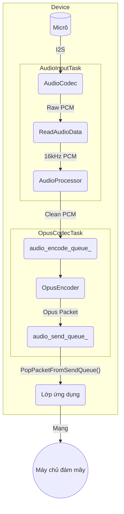
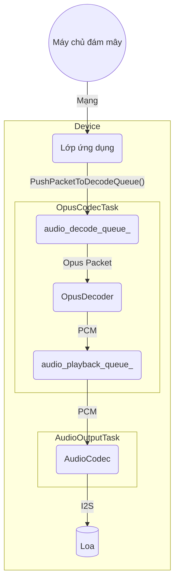

# Kiến trúc Dịch vụ Âm thanh

Dịch vụ âm thanh là một thành phần cốt lõi chịu trách nhiệm quản lý tất cả các chức năng liên quan đến âm thanh, bao gồm thu âm thanh từ micrô, xử lý, mã hóa/giải mã và phát lại âm thanh qua loa. Nó được thiết kế theo kiểu mô-đun và hiệu quả, chạy các hoạt động chính của mình trong các tác vụ FreeRTOS chuyên dụng để đảm bảo hiệu suất thời gian thực.

## Các thành phần chính

- **`AudioService`**: Người điều phối trung tâm. Nó khởi tạo và quản lý tất cả các thành phần âm thanh, tác vụ và hàng đợi dữ liệu khác.
- **`AudioCodec`**: Một lớp trừu tượng phần cứng (HAL) cho chip giải mã âm thanh vật lý. Nó xử lý giao tiếp I2S thô cho đầu vào và đầu ra âm thanh.
- **`AudioProcessor`**: Thực hiện xử lý âm thanh thời gian thực trên luồng đầu vào của micrô. Điều này thường bao gồm Khử tiếng vọng âm thanh (AEC), khử nhiễu và Phát hiện hoạt động giọng nói (VAD). `AfeAudioProcessor` là triển khai mặc định, sử dụng Giao diện người dùng âm thanh ESP-ADF.
- **`WakeWord`**: Phát hiện các từ khóa (ví dụ: "你好，小智", "Hi, ESP") từ luồng âm thanh. Nó chạy độc lập với bộ xử lý âm thanh chính cho đến khi phát hiện thấy từ đánh thức.
- **`OpusEncoderWrapper` / `OpusDecoderWrapper`**: Quản lý việc mã hóa âm thanh PCM sang định dạng Opus và giải mã các gói Opus trở lại PCM. Opus được sử dụng vì khả năng nén cao và độ trễ thấp, lý tưởng cho việc truyền phát giọng nói.
- **`OpusResampler`**: Một tiện ích để chuyển đổi các luồng âm thanh giữa các tốc độ lấy mẫu khác nhau (ví dụ: lấy mẫu lại từ tốc độ lấy mẫu gốc của codec sang 16kHz cần thiết để xử lý).

## Mô hình luồng

Dịch vụ hoạt động trên ba tác vụ chính để xử lý đồng thời các giai đoạn khác nhau của quy trình âm thanh:

1. **`AudioInputTask`**: Chịu trách nhiệm duy nhất đọc dữ liệu PCM thô từ `AudioCodec`. Sau đó, nó cung cấp dữ liệu này cho công cụ `WakeWord` hoặc `AudioProcessor` dựa trên trạng thái hiện tại.
2. **`AudioOutputTask`**: Chịu trách nhiệm phát âm thanh. Nó truy xuất dữ liệu PCM đã giải mã từ `audio_playback_queue_` và gửi nó đến `AudioCodec` để phát trên loa.
3. **`OpusCodecTask`**: Một tác vụ công nhân xử lý cả mã hóa và giải mã. Nó lấy âm thanh thô từ `audio_encode_queue_`, mã hóa nó thành các gói Opus và đặt chúng vào `audio_send_queue_`. Đồng thời, nó lấy các gói Opus từ `audio_decode_queue_`, giải mã chúng thành PCM và đặt kết quả vào `audio_playback_queue_`.

## Luồng dữ liệu

Có hai luồng dữ liệu chính: đầu vào âm thanh (đường lên) và đầu ra âm thanh (đường xuống).

### 1. Luồng đầu vào âm thanh (đường lên)

Luồng này thu âm thanh từ micrô, xử lý, mã hóa và chuẩn bị để gửi đến máy chủ.

- `AudioInputTask` liên tục đọc dữ liệu PCM thô từ `AudioCodec`.
- Dữ liệu này được đưa vào `AudioProcessor` để làm sạch (AEC, VAD).
- Dữ liệu PCM đã xử lý được đẩy vào `audio_encode_queue_`.
- `OpusCodecTask` lấy dữ liệu PCM, mã hóa nó thành định dạng Opus và đẩy gói kết quả vào `audio_send_queue_`.
- Sau đó, ứng dụng có thể truy xuất các gói Opus này và gửi chúng qua mạng.

### 2. Luồng đầu ra âm thanh (đường xuống)

Luồng này nhận dữ liệu âm thanh đã mã hóa, giải mã và phát trên loa.

- Ứng dụng nhận các gói Opus từ mạng và đẩy chúng vào `audio_decode_queue_`.
- `OpusCodecTask` truy xuất các gói này, giải mã chúng trở lại dữ liệu PCM và đẩy dữ liệu vào `audio_playback_queue_`.
- `AudioOutputTask` lấy dữ liệu PCM từ hàng đợi và gửi nó đến `AudioCodec` để phát lại.

## Quản lý năng lượng

Để tiết kiệm năng lượng, các kênh đầu vào (ADC) và đầu ra (DAC) của codec âm thanh sẽ tự động bị vô hiệu hóa sau một khoảng thời gian không hoạt động (`AUDIO_POWER_TIMEOUT_MS`). Một bộ đếm thời gian (`audio_power_timer_`) định kỳ kiểm tra hoạt động và quản lý trạng thái nguồn. Các kênh sẽ tự động được kích hoạt lại khi cần thu hoặc phát âm thanh mới. 