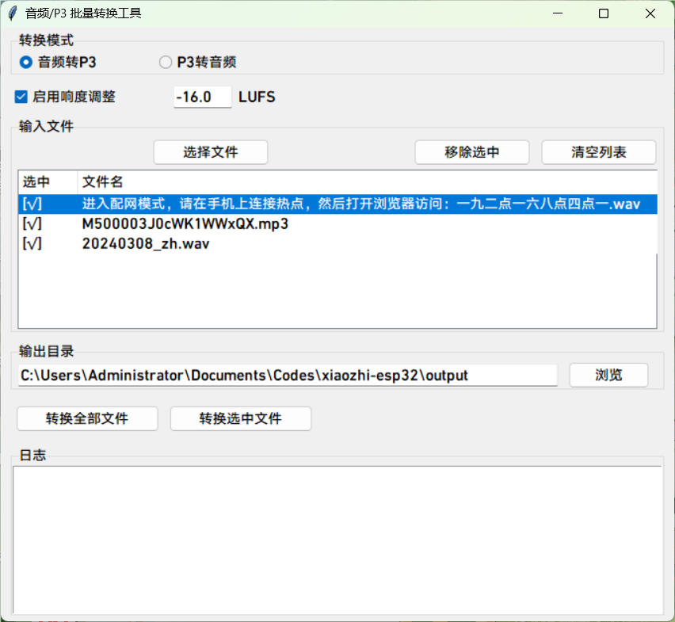

# Công cụ Chuyển đổi và Phát Âm thanh Định dạng P3

Thư mục này chứa hai tập lệnh Python để xử lý các tệp âm thanh định dạng P3:

## 1. Công cụ Chuyển đổi Âm thanh (convert_audio_to_p3.py)

Chuyển đổi các tệp âm thanh thông thường sang định dạng P3 (cấu trúc luồng gồm tiêu đề 4 byte + gói dữ liệu Opus) và thực hiện chuẩn hóa độ lớn.

### Cách sử dụng

```bash
python convert_audio_to_p3.py <tệp_âm_thanh_đầu_vào> <tệp_p3_đầu_ra> [-l LUFS] [-d]
```

Trong đó, tùy chọn `-l` được sử dụng để chỉ định độ lớn mục tiêu cho việc chuẩn hóa, mặc định là -16 LUFS; tùy chọn `-d` có thể được sử dụng để tắt chuẩn hóa độ lớn.

Nếu tệp âm thanh đầu vào đáp ứng bất kỳ điều kiện nào sau đây, bạn nên sử dụng `-d` để tắt chuẩn hóa độ lớn:
- Âm thanh quá ngắn
- Âm thanh đã được điều chỉnh độ lớn
- Âm thanh đến từ TTS mặc định (độ lớn mặc định của TTS hiện đang được MiMi AI sử dụng đã là -16 LUFS)

Ví dụ:
```bash
python convert_audio_to_p3.py input.mp3 output.p3
```

## 2. Công cụ Phát Âm thanh P3 (play_p3.py)

Phát các tệp âm thanh định dạng P3.

### Tính năng

- Giải mã và phát các tệp âm thanh định dạng P3
- Áp dụng hiệu ứng mờ dần khi phát lại kết thúc hoặc bị người dùng ngắt, để tránh vỡ tiếng
- Hỗ trợ chỉ định tệp để phát thông qua các đối số dòng lệnh

### Cách sử dụng

```bash
python play_p3.py <đường_dẫn_tệp_p3>
```

Ví dụ:
```bash
python play_p3.py output.p3
```

## 3. Công cụ Chuyển đổi ngược (convert_p3_to_audio.py)

Chuyển đổi định dạng P3 trở lại tệp âm thanh thông thường.

### Cách sử dụng

```bash
python convert_p3_to_audio.py <tệp_p3_đầu_vào> <tệp_âm_thanh_đầu_ra>
```

Tệp âm thanh đầu ra cần có phần mở rộng.

Ví dụ:
```bash
python convert_p3_to_audio.py input.p3 output.wav
```
## 4. Công cụ Chuyển đổi hàng loạt Âm thanh/P3

Một công cụ đồ họa hỗ trợ chuyển đổi hàng loạt từ âm thanh sang P3 và từ P3 sang âm thanh.



### Cách sử dụng:
```bash
python batch_convert_gui.py
```

## Cài đặt Phụ thuộc

Trước khi sử dụng các tập lệnh này, hãy đảm bảo bạn đã cài đặt các thư viện Python cần thiết:

```bash
pip install librosa opuslib numpy tqdm sounddevice pyloudnorm soundfile
```

Hoặc sử dụng tệp requirements.txt được cung cấp:

```bash
pip install -r requirements.txt
```

## Mô tả Định dạng P3

Định dạng P3 là một định dạng âm thanh luồng đơn giản, có cấu trúc như sau:
- Mỗi khung âm thanh bao gồm một tiêu đề 4 byte và một gói dữ liệu được mã hóa Opus
- Định dạng tiêu đề: [1 byte loại, 1 byte dành riêng, 2 byte độ dài]
- Tốc độ lấy mẫu được cố định ở 16000Hz, đơn kênh
- Thời lượng mỗi khung là 60ms
